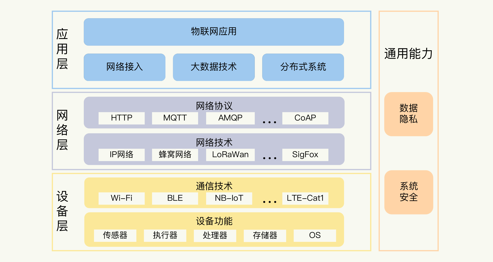
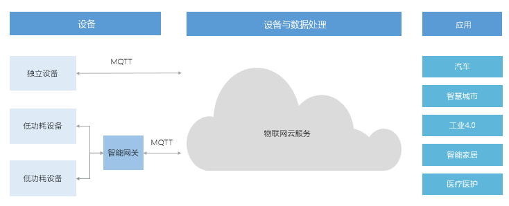
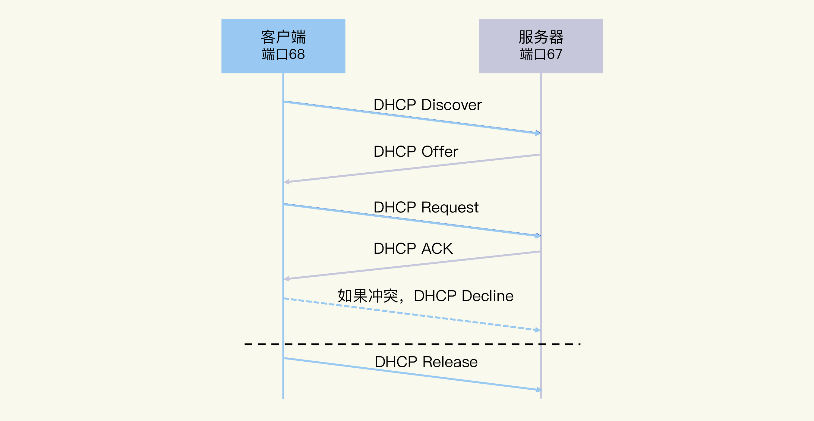
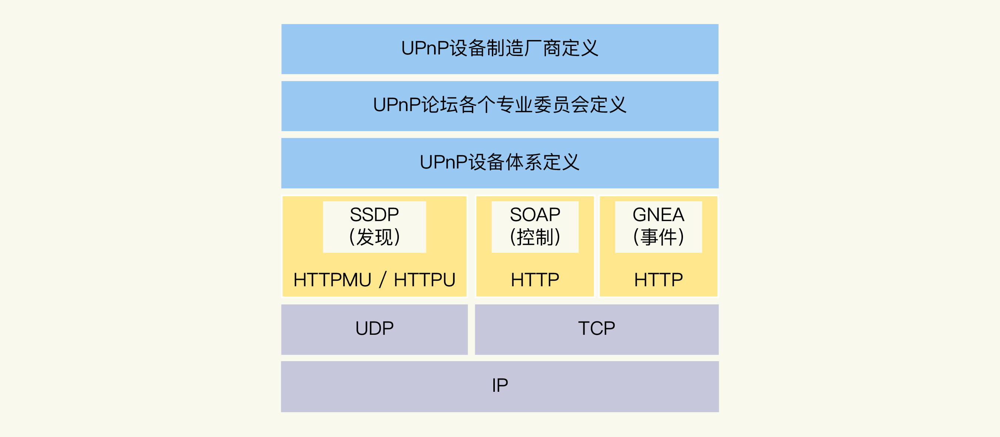
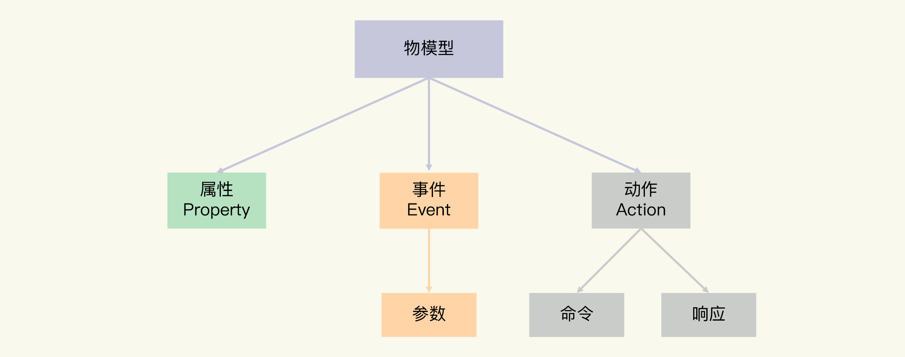

# IOT

物联网从整个体系结构来看，可以分为三个层面。  

第一是设备层，也就是各种硬件设备。  
设备组件有传感器，比如测量温度、湿度、光照强度等参数的设备；也有执行器，比如控制电路通断的继电器、实现物体移动的马达等。物联网设备，不仅涉及传统嵌入式系统的开发，而且也需要考虑通信技术，比如 Wi-Fi、蓝牙和蜂窝网络等。  

第二是网络层，主要关注的是设备与物联网平台的通信协议。  
物联网的网络通信仍然是基于互联网的，所以底层还是 TCP/IP 协议。应用中你更多需要了解、掌握的是具体的网络协议，比如 HTTP、MQTT 和 AMQP 等。  

第三是应用层，也就是实现具体业务逻辑的地方。  
除了像普通互联网后台一样，要面对服务器框架、数据库系统、消息队列等问题外，物联网系统首先需要处理的就是海量的数据。这又可以分为三个方面：  

1. 数据存储，比如 NoSQL 数据库和时序数据库的选择。
2. 数据处理，比如 Spark、Flink 等大数据处理框架的不同特点，批处理和流处理的适用场景等。
3. 数据分析，如各类机器学习算法，甚至 AI 的应用。



## 1. 通信协议之MQTT

MQTT是基于二进制消息的发布/订阅编程模式的消息协议，最早由IBM提出的，如今已经成为OASIS规范。由于规范很简单，非常适合需要低功耗和网络带宽有限的IoT场景，比如：  

遥感数据  
汽车  
智能家居  
智慧城市  
医疗医护  

由于物联网的环境是非常特别的，所以MQTT遵循以下设计原则：  

精简，不添加可有可无的功能。  
发布/订阅（Pub/Sub）模式，方便消息在传感器之间传递。  
允许用户动态创建主题，零运维成本。  
把传输量降到最低以提高传输效率。  
把低带宽、高延迟、不稳定的网络等因素考虑在内。  
支持连续的会话控制。  
理解客户端计算能力可能很低。  
提供服务质量管理。  
假设数据不可知，不强求传输数据的类型与格式，保持灵活性。  

运用MQTT协议，设备可以很方便地连接到物联网云服务，管理设备并处理数据，最后应用到各种业务场景，如下图所示：  



### 1.1. MQTT 协议原理

基于发布/订阅模式的 MQTT 协议中有三种角色：发布者（Publisher）、代理（Broker）、订阅者（Subscriber）。发布者向代理发布消息，代理向订阅者转发这些消息。通常情况下，客户端的角色是发布者和订阅者，服务器的角色是代理，但实际上，服务器也可能主动发布消息或者订阅主题，客串一下客户端的角色。  

为了方便理解，MQTT 传输的消息可以简化为：主题（Topic）和载荷（Payload）两部分：  

Topic，消息主题，订阅者向代理订阅主题后，一旦代理收到相应主题的消息，就会向订阅者转发该消息。  
Payload，消息载荷，订阅者在消息中真正关心的部分，通常是业务相关的。  

### 1.2. MQTT 协议基础概念

#### 1.2.1. 客户端 （Client）

使用 MQTT 协议的程序或设备。它可以  

打开连接到服务端的网络连接  
发布应用消息给其它相关的客户端  
订阅以请求接受相关的应用消息  
取消订阅以移除接受应用消息的请求  
关闭连接到服务端的网络连接  

#### 1.2.2. 服务器（Server）  

在发送消息的客户端与已订阅的客户端之间充当中介角色的程序或设备，它可以  

接受来自客户端的网络连接  
接受客户端发布的应用消息  
处理客户端的订阅和取消订阅请求  
转发应用消息给符合条件的已订阅客户端  
关闭来自客户端的网络连接  

#### 1.2.3. 会话（Session）  

每个客户端与服务器建立连接后就是一个会话，客户端和服务器之间有状态交互。会话可以存在于一个网络连接之间，也可以跨越多个连续的网络连接存在。  

#### 1.2.4. 订阅（Subscription）

订阅包含一个主题过滤器（Topic Filter）和一个最大的服务质量（QoS）等级。订阅与单个会话（Session）关联。会话可以包含多于一个的订阅。会话的每个订阅都有一个不同的主题过滤器。  

#### 1.2.5. 主题名（Topic Name）

附加在应用消息上的一个标签，被用于匹配服务端已存在的订阅。服务端会向所有匹配订阅的客户端发送此应用消息。  

#### 1.2.6. 主题过滤器（Topic Filter）

仅在订阅时使用的主题表达式，可以包含通配符，以匹配多个主题名。  

MQTT 主题的更多特性请访问我们的博文：MQTT 主题的高级特性。  

#### 1.2.7. 载荷（Payload）

对于 PUBLISH 报文来说载荷就是业务消息，它可以是任意格式（二进制、十六进制、普通字符串、JSON 字符串、Base64）的数据。  

### 1.3. MQTT 报文结构

MQTT 报文由三部分组成，分别为：固定报头（Fixed header）、可变报头（Variable header）以及有效载荷（Payload）。  

包含报文类型等字段的固定包头存在于所有 MQTT 报文中。可变报头的内容根据报文类型的不同而不同，一些报文中甚至不存在可变报头。有效载荷通常是与业务/场景相关的数据，例如对 PUBLISH 报文来说有效载荷就是应用消息，对 SUBSCRIBE 报文来说有效载荷就是订阅列表。  

MQTT 协议提供了 3 种消息服务质量等级（Quality of Service），它保证了在不同的网络环境下消息传递的可靠性。  

QoS 0：消息最多传递一次，如果当时客户端不可用，则会丢失该消息。  
QoS 1：消息传递至少 1 次。  
QoS 2：消息仅传送一次。  

消息中间件-消息代理（Broker）  

MQTT 协议工作过程中需要一个消息服务器，也称为消息代理（Broker），将消息存放在若干队列中，在合适的时候再将消息转发给接收设备。当接收设备收到信息触发事件完成相对应的操作。它有四个功能：  

1. 【网络连接】，接受来自客户端的网络连接请求
2. 【队列缓存消息数据】，保存客户端发布的数据信息
3. 【断开网络】，处理来自客户端的订阅和退订请求
4. 【消息数据转发】，向订阅的客户端转发数据信息

### 1.4. 开源 MQTT 服务器如何选择

到目前为止，比较流行的开源 MQTT 服务器有几个：

1. Eclipse Mosquitto  

使用 C 语言实现的 MQTT 服务器。Eclipse 组织还还包含了大量的 MQTT 客户端项目：https://www.eclipse.org/paho/#

2. EMQ X  

使用 Erlang 语言开发的 MQTT 服务器，内置强大的规则引擎，支持许多其他 IoT 协议比如 MQTT-SN、 CoAP、LwM2M 等。

3. Mosca  

使用 Node.JS 开发的 MQTT 服务器，简单易用。

4. VerneMQ  

同样使用 Erlang 开发的 MQTT 服务器.  

从支持 MQTT 5.0、稳定性、扩展性、集群能力等方面考虑，EMQ X 的表现应该是最好的：  

使用 Erlang OTP 开发，容错能力好 (电信领域久经考验的语言，曾经做出过 99.9999999% 可用性的交换机设备5)  
官方有大量的扩展插件可供扩展。有很多认证插件，数据存储(backend)插件可供选择。可支持各种关系型数据库，NoSQL 数据库，以及常见消息队列如 Kafka，RabbitMQ，Pulsar 等  
支持集群，支持节点水平扩展  
单节点支持 2000K 并发连接  
支持规则引擎和编解码  

## 2. 零配置组网

配网成功之后，还需要组网，也就是让设备获得一个自己的 IP 地址，同时也知道局域网内的路由器（Router）的 IP 地址和 DNS（Domain Name System）的 IP 地址等信息。设备自己的 IP 地址是它在 TCP/IP 网络中的唯一标识；路由器可以把设备的数据包正确地转发出去；而 DNS 服务器可以帮忙解析出数据包中需要设置的目的地 IP 地址。  

零配置组网就是把这些工作自动化，达到不需要用户手动去操作，甚至实现这个设备可以与网络内的其他设备配合工作的目的。  

### 2.1. DHCP 协议

这个自动分配功能是基于 DHCP 协议（Dynamic Host Configuration Protocol，动态主机配置协议）实现的。  

DHCP 使用了服务器 - 客户端的架构模型。  

- 当一个设备（你的手机）接入网络时，它自己就会作为 DHCP 客户端，请求网络地址。  
- 然后 DHCP 服务器（家里的 Wi-Fi 路由器）会从地址池中挑选一个 IP 地址，分配给这个设备。  
- 当设备不再使用这个 IP 时（你带着手机出门 / 睡觉飞行模式），DHCP 服务器会进行回收，之后再分配给其他有需要的设备（你新买的平板）使用。  

DHCP 服务器与设备之间的通信是通过 UDP 传输协议完成的。因为 UDP 有一个优势，那就是不需要提前建立连接关系。DHCP 服务器的端口号是 67，设备的端口号是 68，它们一般的交互过程是这样的：  



1. Discover：设备以广播的方式发送 DHCP Discover 消息，表示需要获取 IP 地址。
2. Offer：DHCP 服务器收到这个消息后，会发出 DHCP Offer 消息，作为回应。消息中带有 DHCP 服务器为设备分配的 IP 地址，也会包含其自身的 IP 地址。
3. Request：设备收到 DHCP Offer 消息后，将会广播一条 DHCP Request 消息，正式向 DHCP 服务器请求这个 IP 地址。
4. ACK：DHCP 服务器收到 DHCP Request 消息后，会判断服务器 IP 是否和自己的地址一致。如果一致，马上向设备回复 DHCP ACK 消息，并指定好 IP 地址的租用期限。
5. Decline：设备收到 DHCP ACK 消息后，还会验证一下 IP 地址是否可用。如果地址冲突，就说明不可用，它会发出 DHCP Decline 消息；如果地址不冲突，就可用的，设备将会按照租期使用这个 IP 地址。
6. Release：当设备不使用这个 IP 地址时，设备可以通过发送 DHCP Release 消息，来释放它。这样 DHCP 服务器可以重新分配这个 IP 地址。

### 2.2. UPnP 协议

[手机投屏技术原理](https://www.cnblogs.com/dddcai/p/6480799.html)

UPnP 是 Universal Plug and Play 的简称，它要实现的目标就是网络设备的即插即用。  

UPnP 由设备寻址、设备发现、设备描述、设备控制、事件通知和基于 HTML 的描述界面六部分构成。其中设备寻址同样是基于DHCP 实现，如果网络内没有 DHCP 服务器，UPnP 会基于自己的 AutoIP 方法指定一个 IP 地址。  

从整体看，UPnP 是一个多层协议构成的框架体系，每一层都以相邻的下层为基础，同时又是相邻上层的基础，直至达到应用层为止。可以参考下面的图片。



第三层（从下往上数），它基于 HTTP、HTTPU、HTTPMU 协议，属于传送协议层。传送的内容都是经过“封装”之后，存放在特定的 XML 文件中的。用于设备和服务发现的 SSDP（Simple Service Discovery Protocol，简单服务发现协议）协议就是基于 XML 传送数据的。  

SSDP 协议, 它既提供了服务发现的功能，也提供了设备发现的功能。我们可以基于 SSDP 中的 M-SEARCH 方法来查询设备，然后基于设备的响应，获得设备的服务能力的描述信息。同时设备可以通过 NOTIFY 方法向网络通知自己的服务能力。  

借助 UPnP 协议，你的设备就可以自动被发现和使用了。这个自动化的过程，我们通常用一个专有名词来概括，也就是零配置组网。梳理一下，零配置组网包括三个方面的技术内核：  

1. 为网络设备自动分配 IP 地址，一般涉及 DHCP 协议和 AutoIP 方法；
2. 自动发现和解析设备，主要是基于 SSDP 协议；  
3. 自动传播和发现各网络设备提供的服务，主要也是基于 SSDP 协议。  

那为了实现 UPnP 协议，你可以使用哪些开源的代码实现呢？  
比较流行的开源库是 [libupnp](https://pupnp.sourceforge.io/)，小米电视盒子使用的就是这个开源库。另外还有一个选择是[GUPnP](https://wiki.gnome.org/Projects/GUPnP) 项目，它包括几个不同的子项目，比如实现 SSDP 协议的GSSDP 项目。  

### 2.3. mDNS 和 DNS-SD

除了 UPnP 协议，零配置组网还可以使用别的协议标准，比如 mDNS 和 DNS-SD 协议。  

苹果设备的AirDrop 是通过 Bonjour 服务来发现网络上的其他苹果设备的。这个 Bonjour 服务就是 mDNS 协议和 DNS-SD 协议的具体实现。  

mDNS （Multicast DNS）协议允许设备在本地的 DNS 名字空间，设置一个本地的域名。之后被询问的时候，它就通过 UDP 把 IP 地址广播出来，这样其它的设备就可以找到它。可以简单地把 mDNS 理解为 DNS 的本地网络版本。  

DNS-SD（DNS Service Discovery） 协议，一般是和 mDNS 一起使用的。它使用三种 DNS 协议的记录类型来定义协议内容，三个记录分别是：PTR 记录、SRV 记录和 TXT 记录。它提供了服务发现的功能，作用类似于上面讲到的 SSDP 协议。  

## 3. 物模型

物联网中的这层规范就是 Thing Specification Language，简称 TSL。使用 TSL 描述的物联网中的实体模型，就是“物模型”，或者叫做“产品模型”，也有叫“数据模板”的。  

### 3.1. 物模型和设备的关系是什么

物模型也规约了设备的功能。新增加的设备，如果是同一类型的，在设计、研发中，会遵循相同的功能定义，有相同的特征，实现相同的服务。比如，灯都应该有“开”和“关”两种状态。  

### 3.2. 为什么要使用物模型

基于共同的抽象特征，物模型可以让应用程序不再针对一个个的产品设备，而是同一类设备采用相同的处理逻辑。这实际上是应用开发的基础。当烟感传感器的数值触发报警时，即使是不同品牌的烟感产品，应用程序也可以对数值做相同的处理和判断，否则只能分别进行数值分析。  

另外，物模型中，设备的功能是明确定义的，可以方便地实现场景联动。比如，光线传感器可以基于光照强度，向智能电灯发送亮度的控制命令，或者开和关的命令。  

### 3.3. 如何定义物模型

一般是通过属性、事件和动作这三种功能元素来定义。  

**属性（Property）**：描述了产品设备运行时的某种状态。  

属性的特点是可读可写。也就是说，应用程序可以读取属性，也可以设置设备的属性。我们还可以看到类似的例子，比如环境监测设备的温度、湿度这两个属性等。  

**事件（Event）**：由产品设备在运行过程中产生的信息、告警和故障等。  

如果智能电灯在运行过程中，出现了低电压的情况，或者发生了硬件故障，那么联网的设备可以将这些信息发送出去，通知你来及时作出处理。  

一个事件可以包含多个输出参数。事件不同于属性，事件是设备上报的，不能由应用来设置。类似的例子，还有某任务完成时的消息，环境传感器检测到污染物的告警等。  

**动作（Action）**：这种设备可以被调用的能力或者方法，也被称作服务（Service）。  

动作由应用下发给设备，设备可以返回结果给应用。从执行的流程看，动作还可以进一步分为同步和异步。这取决于动作是否是个耗时的操作，以及其他应用逻辑对于动作执行结果的依赖关系。  

相比于属性，动作是应用下发到设备的控制命令；动作可通过一条指令实现更复杂的业务逻辑，比如，调低温度 5 度，旋转摄像头 30°等。



作为一种模型语言，物模型的数据也有不同的数据类型。它们主要包括六种：  

1. 布尔型（Bool）：非真即假的二值型变量。例如，开关功能只有开、关两种状态。
2. 整数型（Int）：可用于线性调节的整数变量。例如，电灯的亮度是一个整数范围。
3. 字符串型（String）：以字符串形式表达的功能点。例如，灯的位置。
4. 浮点型（Float）：精度为浮点型的功能点。例如，电压值的范围是 0.0 - 24.0。
5. 枚举型（Enum）：自定义的有限集合值。例如，灯的颜色有白色、红色、黄色等。
6. 时间型（Timestamp）：String 类型的 UTC 时间戳。

对于整数型、浮点型的数值，它们的单位可以是百分比、电压、米等。  
物模型一般是用 JSON 格式来表述模型元素。JSON 是 Web 开发中，经常使用的数据格式，相比于 XML，它更加简洁、清晰，也更轻量级。  

按照属性、事件、动作 / 服务这三个要素，一起看看如何用 JSON 格式来定义智能电灯的物模型吧。  

### 3.4. 定义智能电灯的物模型

智能电灯的开关属性是布尔类型，是必须有的属性。它可以通过 JSON 表述如下：

```json

{
  "id": "power_switch",   //属性的唯一标识
  "name": "电灯开关",      //名称
  "desc": "控制电灯开灭",   //属性的详细描述
  "required": true,       //表示此属性是否必需包含，是
  "mode": "rw",           //属性的模式，r代表读，w代表写
  "define": {             //属性的数值定义
    "type": "bool",       //数值的类型，布尔
    "mapping": {          //具体数值的含义
      "0": "关",           //0表示灯关闭
      "1": "开"            //1表示灯打开
    }
  }
}
```

智能电灯的电压是需要监控的数值，当电压低时，可以上报这个事件。这个事件有一个参数，即电压值，数据类型是浮点类型。JSON 格式的描述如下：

```json
{
  "id": "low_voltage",      //事件唯一标识
  "name": "LowVoltage",      //事件名称
  "desc": "Alert for device voltage is low",  //事件的描述
  "type": "alert",          //事件的类型，告警
  "required": false,        //表示此属性是否必需包含，否
  "params": [                //事件的参数
    {
      "id": "voltage",        //事件参数的唯一标识
      "name": "Voltage",      //事件参数的名称
      "desc": "Current voltage",  //参数的描述
      "define": {                 //参数的数值定义
        "type": "float",          //数值类型，浮点数
        "unit": "V",              //数值的单位，伏
        "step": "1",              //数值变化的步长，1
        "min": "0.0",              //数值的最小值
        "max": "24.0",             //数值的最大值
        "start": "1"                //事件的起始值
      }
    }
  ]
}
```

动作的定义，和属性、事件的定义过程类似，将所有属性、事件和动作合并，就得到了智能电灯物模型的完整 JSON 格式：

```json

{
  "version": "1.0",            //模型版本
  "properties": [              //属性列表
    {
      "id": "power_switch",    //电灯开关属性
      "name": "电灯开关",
      "desc": "控制电灯开灭",
      "required": true,
      "mode": "rw",
      "define": {
        "type": "bool",
        "mapping": {
          "0": "关",
          "1": "开"
        }
      }
    },
    {
      "id": "brightness",        //亮度属性
      "name": "亮度",
      "desc": "灯光亮度",
      "mode": "rw",
      "define": {
        "type": "int",
        "unit": "%",
        "step": "1",
        "min": "0",
        "max": "100",
        "start": "1"
      }
    },
    {
      "id": "color",            //电灯颜色属性
      "name": "颜色",
      "desc": "灯光颜色",
      "mode": "rw",
      "define": {
        "type": "enum",
        "mapping": {
          "0": "Red",
          "1": "Green",
          "2": "Blue"
        }
      }
    },
    {
      "id": "color_temp",        //色温属性
      "name": "色温",
      "desc": "灯光冷暖",
      "mode": "rw",
      "define": {
        "type": "int",
        "min": "0",
        "max": "100",
        "start": "0",
        "step": "10",
        "unit": "%"
      }
    }
  ],
  "events": [                        //事件列表
    {
      "id": "status_report",          //运行状态报告
      "name": "DeviceStatus",
      "desc": "Report the device status",
      "type": "info",
      "required": false,
      "params": [                      //事件参数列表
        {
          "id": "status",
          "name": "running_state",
          "desc": "Report current device running state",
          "define": {
            "type": "bool",
            "mapping": {
              "0": "normal",
              "1": "fault"
            }
          }
        },
        {
          "id": "message",
          "name": "Message",
          "desc": "Some extra message",
          "define": {
            "type": "string",
            "min": "0",
            "max": "64"
          }
        }
      ]
    },
    {
      "id": "low_voltage",            //低电压告警事件
      "name": "LowVoltage",
      "desc": "Alert for device voltage is low",
      "type": "alert",
      "required": false,
      "params": [
        {
          "id": "voltage",
          "name": "Voltage",
          "desc": "Current voltage",
          "define": {
            "type": "float",
            "unit": "V",
            "step": "1",
            "min": "0.0",
            "max": "24.0",
            "start": "1"
          }
        }
      ]
    },
    {
      "id": "hardware_fault",            //硬件错误事件
      "name": "Hardware_fault",
      "desc": "Report hardware fault",
      "type": "fault",
      "required": false,
      "params": [
        {
          "id": "name",
          "name": "Name",
          "desc": "Name like: memory,tf card, censors ...",
          "define": {
            "type": "string",
            "min": "0",
            "max": "64"
          }
        },
        {
          "id": "error_code",
          "name": "Error_Code",
          "desc": "Error code for fault",
          "define": {
            "type": "int",
            "unit": "",
            "step": "1",
            "min": "0",
            "max": "2000",
            "start": "1"
          }
        }
      ]
    }
  ],
  "actions": [],                  //动作列表
  "profile": {                    //产品参数
    "ProductId": "8D1GQLE4VA",    //产品ID
    "CategoryId": "141"            //产品分类编号
  }
}
```

### 3.5. 每个模型都要从头定义吗

创建模型的时候，有拷贝和继承两种模式，这两种创建模式的不同主要体现在模型关系上。  

“拷贝”模式类似于编程语言中的值拷贝，新建模型与被拷贝模型有完全相同的三元素，两个模型相互独立，模型变更互不影响。  

“继承”模式就是面向对象编程中的继承概念，新建模型被定义为“子模型”，被继承的模型定义为“父模型”。  

继承的具体特征是：

1. 子模型继承父模型的所有要素，且继承的元素无法被修改。
2. 子模型可以再被继承，支持多层的继承关系。
3. 子模型可以创建独立的要素，但子模型中新增的要素不可以和所有上级父模型中的元素重名。
4. 当父模型中的元素发生变更时，子模型中继承自父模型的元素同步变更，保持与父模型一致。

### 3.6. 物模型的拓展应用

#### 3.6.1. 设备影子

设备影子用于缓存设备状态。应用程序可以通过设备影子直接获取设备最后一次更新的属性值，而无需每次都访问设备。设备在线时，可以直接获取应用指令；设备离线后，再次上线可以主动拉取应用指令。  

想象一个场景。如果设备网络稳定，很多应用程序请求获取设备状态，设备需要根据请求响应多次，即使响应的结果是一样的。但是可能设备本身处理能力有限，其实无法负载被请求多次的情况。使用设备影子机制，设备只需要主动同步状态给设备影子一次，多个应用程序请求设备影子获取设备状态，即可获取设备最新状态，做到应用程序和设备的解耦。  

比如，智能电灯的开关状态这个属性，手机 App 可以远程控制，你也可以在本地通过物理开关改变。如果网络不稳定，那么平台上存储的状态，和电灯设备的真实状态可能会不一致，导致后续操作逻辑错误。  

设备影子可以通过双向的同步，实现服务器端和设备端属性的一致，从而解决这个问题。  

#### 3.6.3. 数字孪生（Digital Twin）

物模型是物理实体的数字化模型，但主要针对的是物联网中应用的开发和设备的互操作。  

这个模型如果更进一步，集成了物理实体的各类数据，那就是物理实体的忠实映射。同时，在物理实体的整个生命周期中，它会和实体一起进化，积累各种信息和知识，并且促进物理实体的优化。这样的模型就是物理实体的数字孪生.  
