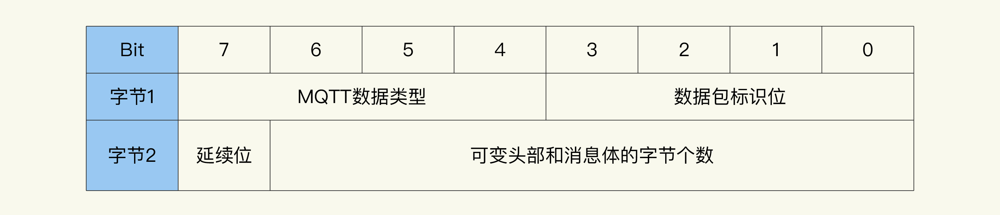
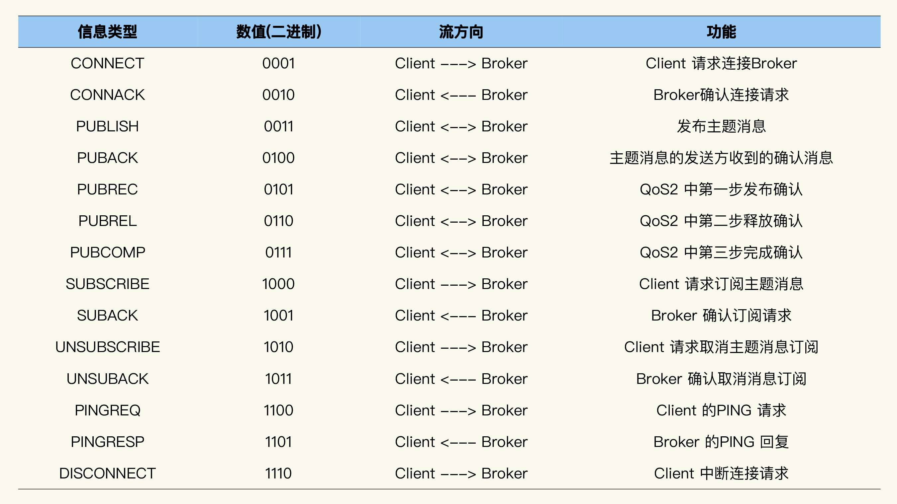
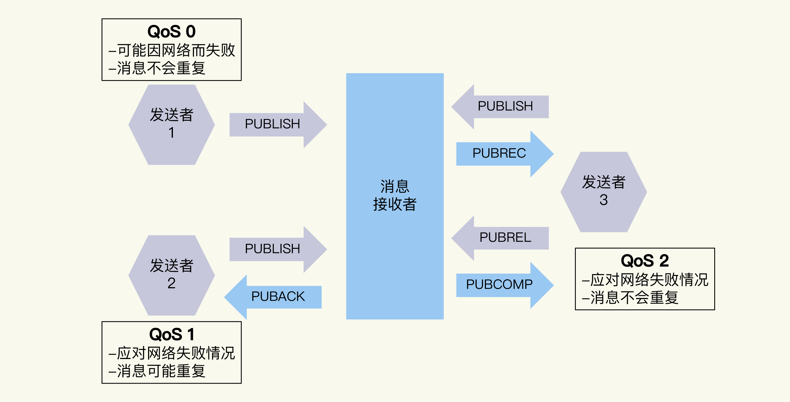
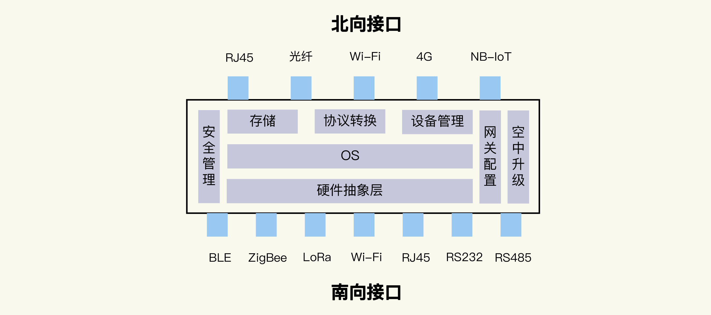
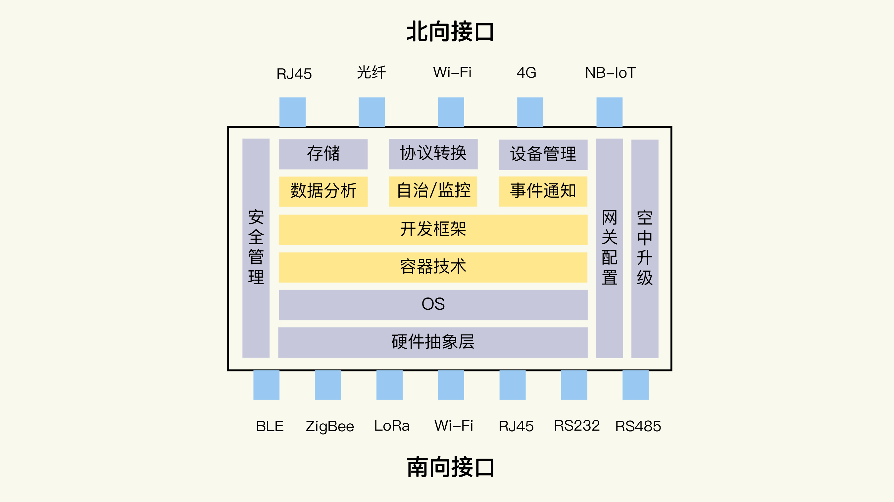

# IOT

物联网从整个体系结构来看，可以分为三个层面。  

第一是设备层，也就是各种硬件设备。  
设备组件有传感器，比如测量温度、湿度、光照强度等参数的设备；也有执行器，比如控制电路通断的继电器、实现物体移动的马达等。物联网设备，不仅涉及传统嵌入式系统的开发，而且也需要考虑通信技术，比如 Wi-Fi、蓝牙和蜂窝网络等。  

第二是网络层，主要关注的是设备与物联网平台的通信协议。  
物联网的网络通信仍然是基于互联网的，所以底层还是 TCP/IP 协议。应用中你更多需要了解、掌握的是具体的网络协议，比如 HTTP、MQTT 和 AMQP 等。  

第三是应用层，也就是实现具体业务逻辑的地方。  
除了像普通互联网后台一样，要面对服务器框架、数据库系统、消息队列等问题外，物联网系统首先需要处理的就是海量的数据。这又可以分为三个方面：  

1. 数据存储，比如 NoSQL 数据库和时序数据库的选择。
2. 数据处理，比如 Spark、Flink 等大数据处理框架的不同特点，批处理和流处理的适用场景等。
3. 数据分析，如各类机器学习算法，甚至 AI 的应用。


## 1. 通信协议之MQTT

MQTT是基于二进制消息的发布/订阅编程模式的消息协议，最早由IBM提出的，如今已经成为OASIS规范。由于规范很简单，非常适合需要低功耗和网络带宽有限的IoT场景，比如：  

遥感数据  
汽车  
智能家居  
智慧城市  
医疗医护  

由于物联网的环境是非常特别的，所以MQTT遵循以下设计原则：  

精简，不添加可有可无的功能。  
发布/订阅（Pub/Sub）模式，方便消息在传感器之间传递。  
允许用户动态创建主题，零运维成本。  
把传输量降到最低以提高传输效率。  
把低带宽、高延迟、不稳定的网络等因素考虑在内。  
支持连续的会话控制。  
理解客户端计算能力可能很低。  
提供服务质量管理。  
假设数据不可知，不强求传输数据的类型与格式，保持灵活性。  

运用MQTT协议，设备可以很方便地连接到物联网云服务，管理设备并处理数据，最后应用到各种业务场景，如下图所示：  


### 1.1. MQTT 协议原理

基于发布/订阅模式的 MQTT 协议中有三种角色：发布者（Publisher）、代理（Broker）、订阅者（Subscriber）。发布者向代理发布消息，代理向订阅者转发这些消息。通常情况下，客户端的角色是发布者和订阅者，服务器的角色是代理，但实际上，服务器也可能主动发布消息或者订阅主题，客串一下客户端的角色。  

为了方便理解，MQTT 传输的消息可以简化为：主题（Topic）和载荷（Payload）两部分：  

Topic，消息主题，订阅者向代理订阅主题后，一旦代理收到相应主题的消息，就会向订阅者转发该消息。  
Payload，消息载荷，订阅者在消息中真正关心的部分，通常是业务相关的。  

### 1.2. MQTT 协议基础概念

#### 1.2.1. 客户端 （Client）

使用 MQTT 协议的程序或设备。它可以  

打开连接到服务端的网络连接  
发布应用消息给其它相关的客户端  
订阅以请求接受相关的应用消息  
取消订阅以移除接受应用消息的请求  
关闭连接到服务端的网络连接  

#### 1.2.2. 服务器（Server）  

在发送消息的客户端与已订阅的客户端之间充当中介角色的程序或设备，它可以  

接受来自客户端的网络连接  
接受客户端发布的应用消息  
处理客户端的订阅和取消订阅请求  
转发应用消息给符合条件的已订阅客户端  
关闭来自客户端的网络连接  

### 1.3. 使用MQTT

安装 hbmqtt，它是一个开源的基于 Python 语言的 MQTT Broker 软件。  

hbmqtt 是基于 Python3 实现的，因此这里使用的是 pip3 工具。  

```text
pip3 install hbmqtt
```

安装完成后，我们就可以使用 hbmqtt 中提供的 hbmqtt_sub 和 hbmqtt_pub 这两个命令行工具了。通过名字，你应该也可以看出 hbmqtt_sub 可以充当订阅者的角色；hbmqtt_pub 可以作为消息的发布者。  

至于订阅者和发布者之间的经纪人，也就是 MQTT Broker，使用  Eclipse 免费开放的在线 [Broker](https://mqtt.eclipse.org/) 服务。打开链接，你可以看到关于端口的介绍信息，加密和非加密方式都支持，而且还有基于 Websocket 的实现，这对基于前端网页的应用来说是非常有利的。  

```text
mqtt.eclipse.org
This is a public test MQTT broker service. It currently listens on the following ports:

1883 : MQTT over unencrypted TCP
8883 : MQTT over encrypted TCP
80 : MQTT over unencrypted WebSockets (note: URL must be /mqtt )
443 : MQTT over encrypted WebSockets (note: URL must be /mqtt )
```

先使用 1883 端口的非加密方式，然后为消息传输确定一个主题（Topic）。主题确定了消息的类别，用于消息过滤。主题可以设为“/learn/iot”。

在电脑的终端界面输入下面的命令，就可以订阅这个主题消息：

```text

hbmqtt_sub --url mqtt://mqtt.eclipse.org:1883 -t /learn/iot
```

想了解一些命令的执行细节，可以在上面的命令中加上 “-d” 参数。  

启动另外一个终端界面，通过 hbmqtt_pub 发布一个 “/learn/iot” 主题的消息：

```text

hbmqtt_pub --url mqtt://mqtt.eclipse.org:1883 -t /learn/iot -m Hello,World!
```

通过 Eclipse 的开放 Broker 作为“经纪人”，消息被传输到了我们通过 hbmqtt_sub 运行的订阅者那里。下图是我的终端界面上运行的结果，一个完整的消息传输过程就这样完成了。

```text
[2020-11-25 11:02:06,375] :: INFO - Finished processing state new exit callbacks.
[2020-11-25 11:02:06,375] :: INFO - Finished processing state connected enter callbacks.
Hello,World!
```

### 1.4. 轻量级协议：减少传输数据量

MQTT 是一个轻量级的网络协议，这一点也是它在物联网系统中流行的重要原因。毕竟物联网中大量的都是计算资源有限、网络带宽低的设备。  

这种“轻量级”体现在两个方面。一方面，MQTT 消息采用二进制的编码格式，而不是 HTTP 协议那样的文本的表述方式。  

可以充分利用字节位，协议头可以很紧凑，从而尽量减少需要通过网络传输的数据量。  

MQTT 协议，一个字节就可以表示很多内容。下面的图片展示了 MQTT 的固定头的格式，这个固定头只有 2 个字节：



第一个字节分成了高 4 位（4～7）和低 4 位（0～3）；低  4  位是数据包标识位，其中的每一比特位又可以表示不同的含义；高 4 位是不同数据包类型的标识位。  

第二个字节表示数据包头部和消息体的字节共个数，其中最高位表示有没有第三字节存在，来和第二个字节一起表示字节共个数。  

如果有第三个字节，那它的最高位表示是否有第四个字节，来和第二个字节、第三个字节一起表示字节总个数。依此类推，还可能有第四个字节、第五个字节，不过这个表示可变头部和消息体的字节个数的部分，最多也只能到第五个字节，所以可以表示的最大数据包长度有 256MB。  

比如，一个请求建立连接的 CONNECT 类型数据包，头部需要 14 个字节；发布消息的 PUBLISH 类型数据包头部只有 2～4 个字节。  

轻量级的另一方面，体现在消息的具体交互流程设计非常简单，所以 MQTT 的交互消息类型也非常少。总结了 MQTT 不同的数据包类型的功能和发消息的流向。  

MQTT 3.1.1 版本一共定义了 14 种数据包的类型，在第一个字节的高 4 位中分别对应从 1 到 14 的数值。  



### 1.5. 低功耗优化：节约电量和网络资源

MQTT 协议还很注重低功耗的优化设计，这主要体现在对能耗和通信次数的优化。  

比如，MQTT 协议有一个 Keepalive 机制。它的作用是，在 Client 和 Broker 的连接中断时，让双方能及时发现，并重新建立 MQTT 连接，保证主题消息的可靠传输。  

这个机制工作的原理是：Client 和 Broker 都基于 Keepalive 确定的时间长度，来判断一段时间内是否有消息在双方之间传输。这个 Keepalive 时间长度是在 Client 建立连接时设置的，如果超出这个时间长度，双方没有收到新的数据包，那么就判定连接断开。  

虽然 Keepalive 要求一段时间内必须有数据包传输，但实际情况是，Client 和 Broker 不可能时时刻刻都在传输主题消息，这要怎么办呢？  

MQTT 协议的解决方案是，定义了 PINGREQ 和 PINGRESP 这两种消息类型。它们都没有可变头部和消息体，也就是说都只有  2  个字节大小。Client 和 Broker 通过分别发送 PINGREQ 和 PINGRESP 消息，就能够满足 Keepalive 机制的要求。  

如果要一直这样“傻傻地”定期发送消息，那也太浪费电量和网络资源了。所以，如果在 Keepalive 时间长度内，Client 和 Broker 之间有数据传输，那么 Keepalive 机制也会将其计算在内，这样就不需要再通过发送 PINGREQ 和 PINGRESP 消息来判断了。  

除了 Keepalive 机制，MQTT 5.0 中的重复主题特性也能帮助我们节省网络资源。  

Client 在重复发送一个主题的消息时，可以从第二次开始，将主题名长度设置为 0，这样 Broker 会自动按照上次的主题来处理消息。这种情况对传感器设备来说十分常见，所以这个特性在工作中很有实际意义  

### 1.6. 3 种 QoS 级别：可靠通信

除了计算资源有限、网络带宽低，物联网设备还经常遇到网络环境不稳定的问题，尤其是在移动通信、卫星通信这样的场景下。比如共享单车，如果用户已经锁车的这个消息，不能可靠地上传到服务器，那么计费就会出现错误，结果引起用户的抱怨。  

MQTT 协议设计了 3 种不同的 QoS （Quality of Service，服务质量）级别。你可以根据场景灵活选择，在不同环境下保证通信是可靠的。  

这 3 种级别分别是：  

1. QoS 0，表示消息最多收到一次，即消息可能丢失，但是不会重复。
2. QoS 1，表示消息至少收到一次，即消息保证送达，但是可能重复。
3. QoS 2，表示消息只会收到一次，即消息有且只有一次。



QoS 0 和 QoS 1 的流程相对比较简单；而 QoS 2 为了保证有且只有一次的可靠传输，流程相对复杂些。正常情况下，QoS 2 有 PUBLISH、PUBREC、PUBREL 和 PUBCOMP 4 次交互。  

至于“不正常的情况”，发送方就需要重复发送消息。比如一段时间内没有收到 PUBREC 消息，就需要再次发送 PUBLISH 消息。不过要注意，这时要把消息中的 “重复”标识设置为 1，以便接收方能正确处理。同样地，如果没有收到 PUBCOMP 消息，发送方就需要再次发送 PUBREL 消息。  

### 1.7. 安全传输

需要验证 Client 是否有权限接入 MQTT Broker。为了控制 Client 的接入，MQTT 提供了用户名 / 密码的机制。在建立连接过程中，它可以通过判断用户名和密码的正确性，来筛选有效连接请求。  

但是光靠这个机制，还不能保证网络通信过程中的数据安全。因为在明文传输的方式下，不止设备数据，甚至用户名和密码都可能被其他人从网络上截获而导致泄漏，于是其他人就可以伪装成合法的设备发送数据。所以，我们还需要通信加密技术的支持。  

MQTT 协议支持 SSL/TLS 加密通信方式。采用 SSL/TLS 加密之后，MQTT 将转换为 MQTTS。这有点类似于 HTTP 和 HTTPS 的关系。  

将 “mqtt://” 改为 “mqtts://”，端口改为 8883，就可以用 SSL/TLS 加密通信方式连接到 Eclipse 提供的开放 Broker。但是我最近发现，它的 SSL 证书已经过期了，因此连接会失败。  

## 2. 零配置组网

配网成功之后，还需要组网，也就是让设备获得一个自己的 IP 地址，同时也知道局域网内的路由器（Router）的 IP 地址和 DNS（Domain Name System）的 IP 地址等信息。设备自己的 IP 地址是它在 TCP/IP 网络中的唯一标识；路由器可以把设备的数据包正确地转发出去；而 DNS 服务器可以帮忙解析出数据包中需要设置的目的地 IP 地址。  

零配置组网就是把这些工作自动化，达到不需要用户手动去操作，甚至实现这个设备可以与网络内的其他设备配合工作的目的。  

### 2.1. DHCP 协议

这个自动分配功能是基于 DHCP 协议（Dynamic Host Configuration Protocol，动态主机配置协议）实现的。  

DHCP 使用了服务器 - 客户端的架构模型。  

- 当一个设备（你的手机）接入网络时，它自己就会作为 DHCP 客户端，请求网络地址。  
- 然后 DHCP 服务器（家里的 Wi-Fi 路由器）会从地址池中挑选一个 IP 地址，分配给这个设备。  
- 当设备不再使用这个 IP 时（你带着手机出门 / 睡觉飞行模式），DHCP 服务器会进行回收，之后再分配给其他有需要的设备（你新买的平板）使用。  

DHCP 服务器与设备之间的通信是通过 UDP 传输协议完成的。因为 UDP 有一个优势，那就是不需要提前建立连接关系。DHCP 服务器的端口号是 67，设备的端口号是 68，它们一般的交互过程是这样的：  


1. Discover：设备以广播的方式发送 DHCP Discover 消息，表示需要获取 IP 地址。
2. Offer：DHCP 服务器收到这个消息后，会发出 DHCP Offer 消息，作为回应。消息中带有 DHCP 服务器为设备分配的 IP 地址，也会包含其自身的 IP 地址。
3. Request：设备收到 DHCP Offer 消息后，将会广播一条 DHCP Request 消息，正式向 DHCP 服务器请求这个 IP 地址。
4. ACK：DHCP 服务器收到 DHCP Request 消息后，会判断服务器 IP 是否和自己的地址一致。如果一致，马上向设备回复 DHCP ACK 消息，并指定好 IP 地址的租用期限。
5. Decline：设备收到 DHCP ACK 消息后，还会验证一下 IP 地址是否可用。如果地址冲突，就说明不可用，它会发出 DHCP Decline 消息；如果地址不冲突，就可用的，设备将会按照租期使用这个 IP 地址。
6. Release：当设备不使用这个 IP 地址时，设备可以通过发送 DHCP Release 消息，来释放它。这样 DHCP 服务器可以重新分配这个 IP 地址。

### 2.2. UPnP 协议

[手机投屏技术原理](https://www.cnblogs.com/dddcai/p/6480799.html)

UPnP 是 Universal Plug and Play 的简称，它要实现的目标就是网络设备的即插即用。  

UPnP 由设备寻址、设备发现、设备描述、设备控制、事件通知和基于 HTML 的描述界面六部分构成。其中设备寻址同样是基于DHCP 实现，如果网络内没有 DHCP 服务器，UPnP 会基于自己的 AutoIP 方法指定一个 IP 地址。  

从整体看，UPnP 是一个多层协议构成的框架体系，每一层都以相邻的下层为基础，同时又是相邻上层的基础，直至达到应用层为止。可以参考下面的图片。


第三层（从下往上数），它基于 HTTP、HTTPU、HTTPMU 协议，属于传送协议层。传送的内容都是经过“封装”之后，存放在特定的 XML 文件中的。用于设备和服务发现的 SSDP（Simple Service Discovery Protocol，简单服务发现协议）协议就是基于 XML 传送数据的。  

SSDP 协议, 它既提供了服务发现的功能，也提供了设备发现的功能。我们可以基于 SSDP 中的 M-SEARCH 方法来查询设备，然后基于设备的响应，获得设备的服务能力的描述信息。同时设备可以通过 NOTIFY 方法向网络通知自己的服务能力。  

借助 UPnP 协议，你的设备就可以自动被发现和使用了。这个自动化的过程，我们通常用一个专有名词来概括，也就是零配置组网。梳理一下，零配置组网包括三个方面的技术内核：  

1. 为网络设备自动分配 IP 地址，一般涉及 DHCP 协议和 AutoIP 方法；
2. 自动发现和解析设备，主要是基于 SSDP 协议；  
3. 自动传播和发现各网络设备提供的服务，主要也是基于 SSDP 协议。  

那为了实现 UPnP 协议，你可以使用哪些开源的代码实现呢？  
比较流行的开源库是 [libupnp](https://pupnp.sourceforge.io/)，小米电视盒子使用的就是这个开源库。另外还有一个选择是[GUPnP](https://wiki.gnome.org/Projects/GUPnP) 项目，它包括几个不同的子项目，比如实现 SSDP 协议的GSSDP 项目。  

### 2.3. mDNS 和 DNS-SD

除了 UPnP 协议，零配置组网还可以使用别的协议标准，比如 mDNS 和 DNS-SD 协议。  

苹果设备的AirDrop 是通过 Bonjour 服务来发现网络上的其他苹果设备的。这个 Bonjour 服务就是 mDNS 协议和 DNS-SD 协议的具体实现。  

mDNS （Multicast DNS）协议允许设备在本地的 DNS 名字空间，设置一个本地的域名。之后被询问的时候，它就通过 UDP 把 IP 地址广播出来，这样其它的设备就可以找到它。可以简单地把 mDNS 理解为 DNS 的本地网络版本。  

DNS-SD（DNS Service Discovery） 协议，一般是和 mDNS 一起使用的。它使用三种 DNS 协议的记录类型来定义协议内容，三个记录分别是：PTR 记录、SRV 记录和 TXT 记录。它提供了服务发现的功能，作用类似于上面讲到的 SSDP 协议。  

## 3. 物模型

物联网中的这层规范就是 Thing Specification Language，简称 TSL。使用 TSL 描述的物联网中的实体模型，就是“物模型”，或者叫做“产品模型”，也有叫“数据模板”的。  

### 3.1. 物模型和设备的关系是什么

物模型也规约了设备的功能。新增加的设备，如果是同一类型的，在设计、研发中，会遵循相同的功能定义，有相同的特征，实现相同的服务。比如，灯都应该有“开”和“关”两种状态。  

### 3.2. 为什么要使用物模型

基于共同的抽象特征，物模型可以让应用程序不再针对一个个的产品设备，而是同一类设备采用相同的处理逻辑。这实际上是应用开发的基础。当烟感传感器的数值触发报警时，即使是不同品牌的烟感产品，应用程序也可以对数值做相同的处理和判断，否则只能分别进行数值分析。  

另外，物模型中，设备的功能是明确定义的，可以方便地实现场景联动。比如，光线传感器可以基于光照强度，向智能电灯发送亮度的控制命令，或者开和关的命令。  

### 3.3. 如何定义物模型

一般是通过属性、事件和动作这三种功能元素来定义。  

**属性（Property）**：描述了产品设备运行时的某种状态。  

属性的特点是可读可写。也就是说，应用程序可以读取属性，也可以设置设备的属性。我们还可以看到类似的例子，比如环境监测设备的温度、湿度这两个属性等。  

**事件（Event）**：由产品设备在运行过程中产生的信息、告警和故障等。  

如果智能电灯在运行过程中，出现了低电压的情况，或者发生了硬件故障，那么联网的设备可以将这些信息发送出去，通知你来及时作出处理。  

一个事件可以包含多个输出参数。事件不同于属性，事件是设备上报的，不能由应用来设置。类似的例子，还有某任务完成时的消息，环境传感器检测到污染物的告警等。  

**动作（Action）**：这种设备可以被调用的能力或者方法，也被称作服务（Service）。  

动作由应用下发给设备，设备可以返回结果给应用。从执行的流程看，动作还可以进一步分为同步和异步。这取决于动作是否是个耗时的操作，以及其他应用逻辑对于动作执行结果的依赖关系。  

相比于属性，动作是应用下发到设备的控制命令；动作可通过一条指令实现更复杂的业务逻辑，比如，调低温度 5 度，旋转摄像头 30°等。


作为一种模型语言，物模型的数据也有不同的数据类型。它们主要包括六种：  

1. 布尔型（Bool）：非真即假的二值型变量。例如，开关功能只有开、关两种状态。
2. 整数型（Int）：可用于线性调节的整数变量。例如，电灯的亮度是一个整数范围。
3. 字符串型（String）：以字符串形式表达的功能点。例如，灯的位置。
4. 浮点型（Float）：精度为浮点型的功能点。例如，电压值的范围是 0.0 - 24.0。
5. 枚举型（Enum）：自定义的有限集合值。例如，灯的颜色有白色、红色、黄色等。
6. 时间型（Timestamp）：String 类型的 UTC 时间戳。

对于整数型、浮点型的数值，它们的单位可以是百分比、电压、米等。  
物模型一般是用 JSON 格式来表述模型元素。JSON 是 Web 开发中，经常使用的数据格式，相比于 XML，它更加简洁、清晰，也更轻量级。  

按照属性、事件、动作 / 服务这三个要素，一起看看如何用 JSON 格式来定义智能电灯的物模型吧。  

### 3.4. 定义智能电灯的物模型

智能电灯的开关属性是布尔类型，是必须有的属性。它可以通过 JSON 表述如下：

```json

{
  "id": "power_switch",   //属性的唯一标识
  "name": "电灯开关",      //名称
  "desc": "控制电灯开灭",   //属性的详细描述
  "required": true,       //表示此属性是否必需包含，是
  "mode": "rw",           //属性的模式，r代表读，w代表写
  "define": {             //属性的数值定义
    "type": "bool",       //数值的类型，布尔
    "mapping": {          //具体数值的含义
      "0": "关",           //0表示灯关闭
      "1": "开"            //1表示灯打开
    }
  }
}
```

智能电灯的电压是需要监控的数值，当电压低时，可以上报这个事件。这个事件有一个参数，即电压值，数据类型是浮点类型。JSON 格式的描述如下：

```json
{
  "id": "low_voltage",      //事件唯一标识
  "name": "LowVoltage",      //事件名称
  "desc": "Alert for device voltage is low",  //事件的描述
  "type": "alert",          //事件的类型，告警
  "required": false,        //表示此属性是否必需包含，否
  "params": [                //事件的参数
    {
      "id": "voltage",        //事件参数的唯一标识
      "name": "Voltage",      //事件参数的名称
      "desc": "Current voltage",  //参数的描述
      "define": {                 //参数的数值定义
        "type": "float",          //数值类型，浮点数
        "unit": "V",              //数值的单位，伏
        "step": "1",              //数值变化的步长，1
        "min": "0.0",              //数值的最小值
        "max": "24.0",             //数值的最大值
        "start": "1"                //事件的起始值
      }
    }
  ]
}
```

动作的定义，和属性、事件的定义过程类似，将所有属性、事件和动作合并，就得到了智能电灯物模型的完整 JSON 格式：

```json

{
  "version": "1.0",            //模型版本
  "properties": [              //属性列表
    {
      "id": "power_switch",    //电灯开关属性
      "name": "电灯开关",
      "desc": "控制电灯开灭",
      "required": true,
      "mode": "rw",
      "define": {
        "type": "bool",
        "mapping": {
          "0": "关",
          "1": "开"
        }
      }
    },
    {
      "id": "brightness",        //亮度属性
      "name": "亮度",
      "desc": "灯光亮度",
      "mode": "rw",
      "define": {
        "type": "int",
        "unit": "%",
        "step": "1",
        "min": "0",
        "max": "100",
        "start": "1"
      }
    },
    {
      "id": "color",            //电灯颜色属性
      "name": "颜色",
      "desc": "灯光颜色",
      "mode": "rw",
      "define": {
        "type": "enum",
        "mapping": {
          "0": "Red",
          "1": "Green",
          "2": "Blue"
        }
      }
    },
    {
      "id": "color_temp",        //色温属性
      "name": "色温",
      "desc": "灯光冷暖",
      "mode": "rw",
      "define": {
        "type": "int",
        "min": "0",
        "max": "100",
        "start": "0",
        "step": "10",
        "unit": "%"
      }
    }
  ],
  "events": [                        //事件列表
    {
      "id": "status_report",          //运行状态报告
      "name": "DeviceStatus",
      "desc": "Report the device status",
      "type": "info",
      "required": false,
      "params": [                      //事件参数列表
        {
          "id": "status",
          "name": "running_state",
          "desc": "Report current device running state",
          "define": {
            "type": "bool",
            "mapping": {
              "0": "normal",
              "1": "fault"
            }
          }
        },
        {
          "id": "message",
          "name": "Message",
          "desc": "Some extra message",
          "define": {
            "type": "string",
            "min": "0",
            "max": "64"
          }
        }
      ]
    },
    {
      "id": "low_voltage",            //低电压告警事件
      "name": "LowVoltage",
      "desc": "Alert for device voltage is low",
      "type": "alert",
      "required": false,
      "params": [
        {
          "id": "voltage",
          "name": "Voltage",
          "desc": "Current voltage",
          "define": {
            "type": "float",
            "unit": "V",
            "step": "1",
            "min": "0.0",
            "max": "24.0",
            "start": "1"
          }
        }
      ]
    },
    {
      "id": "hardware_fault",            //硬件错误事件
      "name": "Hardware_fault",
      "desc": "Report hardware fault",
      "type": "fault",
      "required": false,
      "params": [
        {
          "id": "name",
          "name": "Name",
          "desc": "Name like: memory,tf card, censors ...",
          "define": {
            "type": "string",
            "min": "0",
            "max": "64"
          }
        },
        {
          "id": "error_code",
          "name": "Error_Code",
          "desc": "Error code for fault",
          "define": {
            "type": "int",
            "unit": "",
            "step": "1",
            "min": "0",
            "max": "2000",
            "start": "1"
          }
        }
      ]
    }
  ],
  "actions": [],                  //动作列表
  "profile": {                    //产品参数
    "ProductId": "8D1GQLE4VA",    //产品ID
    "CategoryId": "141"            //产品分类编号
  }
}
```

### 3.5. 每个模型都要从头定义吗

创建模型的时候，有拷贝和继承两种模式，这两种创建模式的不同主要体现在模型关系上。  

“拷贝”模式类似于编程语言中的值拷贝，新建模型与被拷贝模型有完全相同的三元素，两个模型相互独立，模型变更互不影响。  

“继承”模式就是面向对象编程中的继承概念，新建模型被定义为“子模型”，被继承的模型定义为“父模型”。  

继承的具体特征是：

1. 子模型继承父模型的所有要素，且继承的元素无法被修改。
2. 子模型可以再被继承，支持多层的继承关系。
3. 子模型可以创建独立的要素，但子模型中新增的要素不可以和所有上级父模型中的元素重名。
4. 当父模型中的元素发生变更时，子模型中继承自父模型的元素同步变更，保持与父模型一致。

### 3.6. 物模型的拓展应用

#### 3.6.1. 设备影子

设备影子用于缓存设备状态。应用程序可以通过设备影子直接获取设备最后一次更新的属性值，而无需每次都访问设备。设备在线时，可以直接获取应用指令；设备离线后，再次上线可以主动拉取应用指令。  

想象一个场景。如果设备网络稳定，很多应用程序请求获取设备状态，设备需要根据请求响应多次，即使响应的结果是一样的。但是可能设备本身处理能力有限，其实无法负载被请求多次的情况。使用设备影子机制，设备只需要主动同步状态给设备影子一次，多个应用程序请求设备影子获取设备状态，即可获取设备最新状态，做到应用程序和设备的解耦。  

比如，智能电灯的开关状态这个属性，手机 App 可以远程控制，你也可以在本地通过物理开关改变。如果网络不稳定，那么平台上存储的状态，和电灯设备的真实状态可能会不一致，导致后续操作逻辑错误。  

设备影子可以通过双向的同步，实现服务器端和设备端属性的一致，从而解决这个问题。  

#### 3.6.3. 数字孪生（Digital Twin）

物模型是物理实体的数字化模型，但主要针对的是物联网中应用的开发和设备的互操作。  

这个模型如果更进一步，集成了物理实体的各类数据，那就是物理实体的忠实映射。同时，在物理实体的整个生命周期中，它会和实体一起进化，积累各种信息和知识，并且促进物理实体的优化。这样的模型就是物理实体的数字孪生.  

## 4. 物联网网关

### 4.1. 协议转换

BLE 、ZigBee 和 LoRa 设备在跟网关通信的时候，需要网关基于开放的或者内部私有的协议，解析出数据；然后网关再使用跟云平台的连接协议来组织数据，完成数据传输。  

这个过程自然就要求网关设备能够支持不同的通信技术。  



北向接口需要接入互联网，所以通常的选择有 RJ45 以太网口、光纤接口、Wi-Fi 和 4G、NB-IoT 等蜂窝网络模组等。  

南向接口用来连接物联网设备，除了 BLE、ZigBee、LoRa、Wi-Fi 这些无线技术的接口，常见的还有用在工控机（Industrial Personal Computer，工业控制计算机）上的 RJ45 以太网口、RS232、RS485 等有线接口。

需要注意的是，每个网关设备的接口类型和个数不是固定的，因为网关产品一般会根据应用场景确定几个不同的规格型号。不同型号的网关需要支持不同类型的协议，以及不同个数协议的转换，所以网关的协议转换功能一般采用插件的软件架构方式。  

插件机制这种二次开发能力非常重要。一方面，它让我们可以根据接口的情况，动态、灵活地配置协议转换功能；另一方面，它也可以方便我们开发私有协议的解析功能。  

比如通过 BLE、ZigBee 或 LoRa 技术跟网关通信的设备，它们通常采用的是私有的应用层协议，这就需要我们基于设备架构设计时定义的私有协议，专门编写解析代码。至于使用 RJ45 网口或 Wi-Fi 跟网关连接的物联网设备，除了采用基于 TCP 或者 UDP 的私有协议之外，也可能采用我们之前讲过的 MQTT 或者 CoAP 这样标准的协议。这时，我们就需要按照这些协议的格式来处理。  

### 4.2. 网关的其他功能

网关的存储功能可以防止因网络临时故障等原因，导致设备数据的丢失。另外，网关和设备的配置信息也需要存储在网关中，以便设备运行过程中快速读取。  

同时，数据的安全性也非常重要，物联网网关需要做好这几个方面的事情：  

1. 完善的本地身份认证。这样可以防止网关设备被随意修改软件或者数据。
2. 网关保证数据的加密传输。因为很多物联网设备的计算能力非常弱，不具备进行数据加密的能力，这时就需要借助网关来保证数据或者控制命令的加密和解密。
3. 网关能够支持运营商专网接入，或者支持 VPN（Virtual Private Network，虚拟专用网络）技术。这里我补充说明一下，VPN 技术的好处是基于互联网网络建立加密通道。这样既保证了数据传输的安全可靠，又比建立专线成本要低。常用的 VPN 协议有 IPsec、OpenVPN 等。  

除了刚才讲到的协议转换、存储功能和安全管理，物联网网关一般还有设备管理、网关配置、空中升级这些功能模块。  

### 4.3. 在网关上做数据分析

因为随着物联网的发展，海量的设备接入网络，随之而来的，是更加海量的数据源源不断的产生，并上传到云平台。这就给云平台提出了很大的挑战。一方面是极大地消耗有限的网络带宽资源；另一方面，网络的不确定因素很多，有可能导致不可控的延时，从而对业务应用造成不可接受的影响。  

物联网数据通常与物理实体关系密切。比如家庭监控摄像头中，家庭成员的肖像等视频信息是非常敏感的；而在工业场景中，很多数据是机密的。如果这些信息全部上传到云平台，会给用户带来很大的安全风险。所以，现在行业内已经开始尝试将云平台上的部分计算服务，下沉到靠近数据发生地的“边缘设备”上进行，这就是边缘计算的由来，而物联网网关是边缘计算中最轻量级的解决方案的关键。  

边缘计算的设计，与人体的这个构造类似。边缘设备，比如物联网网关，完成初步的数据处理，和需要及时响应的计算任务；而云平台负责需要大规模数据和复杂计算的数据分析工作，以及完成整体的协调和控制。  

具体来说，云平台将原有的云计算模型的部分计算任务迁移到网络边缘设备上来；网络边缘设备（比如路由器、移动网络基站等），在数据源附近执行数据处理和数据分析任务。这样一来，就降低了云计算中心的计算负载，减轻了物联网对于网络带宽的压力，提高了数据处理的效率。  

边缘计算模型的好处，总结为四个方面：

1. 延迟低。数据只需要从产生设备传输到边缘设备，传输距离短，数据不需要通过其他网络，网络延迟低。
2. 节约了主干网带宽。缓解大量数据传输所造成的网络拥堵想象。尤其像一些银行的专有网络，本身带宽非常有限，只能用于传输关键性的数据。
3. 计算可用性好。数据在网络中的路径长度显著变短，因网络波动引起的计算服务不可用情况将有所减少。
4. 隐私性更好。由于边缘设备距离用户近，用户的隐私数据不再需要上传到云平台，因此，在边缘计算场景下，用户的隐私也可以得到更好的保护。

#### 4.3.1. 边缘计算对网关的影响

首先，为了更好地在网关中运行边缘计算任务，网关需要支持虚拟化技术，这在目前的实践中通常是采用容器技术实现。容器天然具有轻量和可移植的优点，非常适合开发人员快速测试应用程序，也方便维护人员在网关上大规模部署和更新应用程序。另外，容器技术也更利于网关使用容器自动运维平台技术，比如 Kubernetes，来实现应用程序的编排等功能。  

其次，因为网络环境的不确定性，网关需要具备一定的自治能力。当网关与云平台的通信中断时，这种情况不应该影响网关处理数据的计算任务，和对物联网设备的管理。  

最后，因为边缘计算的引入，我们需要在网关侧实现数据分析处理的任务。而网关的硬件资源非常多样，业务需求也千差万别，所以网关上提供统一的开发框架变得更加重要。开发框架可以为开发人员提供一致的 API 和组件的互操作能力。这样开发人员可以更加高效地实现业务功能，也更容易和其他厂商协作。  



#### 4.3.2. 怎样实现边缘计算

目前，在推进边缘计算的标准组织主要有三个，分别是：Linux 基金会下的 LF Edge （Linux Foundation Edge）和致力于推进 Cloud Native 的 CNCF（Cloud Native Computing Foundation）Eclipse 基金会下面的 Eclipse IoT 项目OpenStack 基金会。  

至于容器技术方面的开源项目，主要有 KubeEdge 项目，它的主要思路是将 Kubernetes 从云端扩展到边缘设备，方便应用程序在边缘网关上的编排和调度，同时实现云端和边缘设备的协同数据处理。  

关于开发框架，比较知名的是 EdgeX Foundry 项目，定位是为工业物联网提供通用的边缘计算框架。为此，它适配了很多协议，提供出标准的 API 接口。  

专门针对智能家居领域的项目有 Home Edge ，它是三星贡献的一个开源项目，用于加速智能家居设备的边缘部署。  


