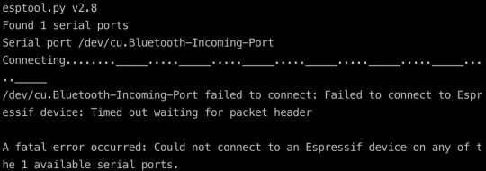
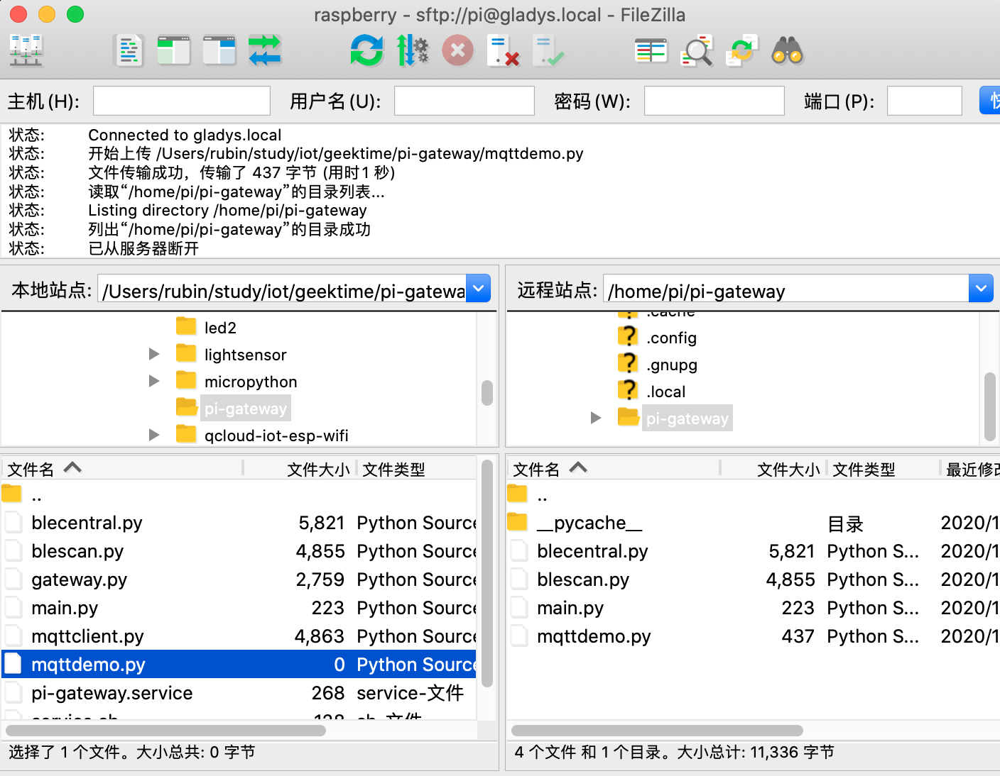

# IOT

物联网从整个体系结构来看，可以分为三个层面。  

第一是设备层，也就是各种硬件设备。  
设备组件有传感器，比如测量温度、湿度、光照强度等参数的设备；也有执行器，比如控制电路通断的继电器、实现物体移动的马达等。物联网设备，不仅涉及传统嵌入式系统的开发，而且也需要考虑通信技术，比如 Wi-Fi、蓝牙和蜂窝网络等。  

第二是网络层，主要关注的是设备与物联网平台的通信协议。  
物联网的网络通信仍然是基于互联网的，所以底层还是 TCP/IP 协议。应用中你更多需要了解、掌握的是具体的网络协议，比如 HTTP、MQTT 和 AMQP 等。  

第三是应用层，也就是实现具体业务逻辑的地方。  
除了像普通互联网后台一样，要面对服务器框架、数据库系统、消息队列等问题外，物联网系统首先需要处理的就是海量的数据。这又可以分为三个方面：  

1. 数据存储，比如 NoSQL 数据库和时序数据库的选择。
2. 数据处理，比如 Spark、Flink 等大数据处理框架的不同特点，批处理和流处理的适用场景等。
3. 数据分析，如各类机器学习算法，甚至 AI 的应用。


## 1. 通信协议之MQTT

MQTT是基于二进制消息的发布/订阅编程模式的消息协议，最早由IBM提出的，如今已经成为OASIS规范。由于规范很简单，非常适合需要低功耗和网络带宽有限的IoT场景，比如：  

遥感数据  
汽车  
智能家居  
智慧城市  
医疗医护  

由于物联网的环境是非常特别的，所以MQTT遵循以下设计原则：  

精简，不添加可有可无的功能。  
发布/订阅（Pub/Sub）模式，方便消息在传感器之间传递。  
允许用户动态创建主题，零运维成本。  
把传输量降到最低以提高传输效率。  
把低带宽、高延迟、不稳定的网络等因素考虑在内。  
支持连续的会话控制。  
理解客户端计算能力可能很低。  
提供服务质量管理。  
假设数据不可知，不强求传输数据的类型与格式，保持灵活性。  

运用MQTT协议，设备可以很方便地连接到物联网云服务，管理设备并处理数据，最后应用到各种业务场景，如下图所示：  


### 1.1. MQTT 协议原理

基于发布/订阅模式的 MQTT 协议中有三种角色：发布者（Publisher）、代理（Broker）、订阅者（Subscriber）。发布者向代理发布消息，代理向订阅者转发这些消息。通常情况下，客户端的角色是发布者和订阅者，服务器的角色是代理，但实际上，服务器也可能主动发布消息或者订阅主题，客串一下客户端的角色。  

为了方便理解，MQTT 传输的消息可以简化为：主题（Topic）和载荷（Payload）两部分：  

Topic，消息主题，订阅者向代理订阅主题后，一旦代理收到相应主题的消息，就会向订阅者转发该消息。  
Payload，消息载荷，订阅者在消息中真正关心的部分，通常是业务相关的。  

### 1.2. MQTT 协议基础概念

#### 1.2.1. 客户端 （Client）

使用 MQTT 协议的程序或设备。它可以  

打开连接到服务端的网络连接  
发布应用消息给其它相关的客户端  
订阅以请求接受相关的应用消息  
取消订阅以移除接受应用消息的请求  
关闭连接到服务端的网络连接  

#### 1.2.2. 服务器（Server）  

在发送消息的客户端与已订阅的客户端之间充当中介角色的程序或设备，它可以  

接受来自客户端的网络连接  
接受客户端发布的应用消息  
处理客户端的订阅和取消订阅请求  
转发应用消息给符合条件的已订阅客户端  
关闭来自客户端的网络连接  

### 1.3. 使用MQTT

安装 hbmqtt，它是一个开源的基于 Python 语言的 MQTT Broker 软件。  

hbmqtt 是基于 Python3 实现的，因此这里使用的是 pip3 工具。  

```text
pip3 install hbmqtt
```

安装完成后，我们就可以使用 hbmqtt 中提供的 hbmqtt_sub 和 hbmqtt_pub 这两个命令行工具了。通过名字，你应该也可以看出 hbmqtt_sub 可以充当订阅者的角色；hbmqtt_pub 可以作为消息的发布者。  

至于订阅者和发布者之间的经纪人，也就是 MQTT Broker，使用  Eclipse 免费开放的在线 [Broker](https://mqtt.eclipse.org/) 服务。打开链接，你可以看到关于端口的介绍信息，加密和非加密方式都支持，而且还有基于 Websocket 的实现，这对基于前端网页的应用来说是非常有利的。  

```text
mqtt.eclipse.org
This is a public test MQTT broker service. It currently listens on the following ports:

1883 : MQTT over unencrypted TCP
8883 : MQTT over encrypted TCP
80 : MQTT over unencrypted WebSockets (note: URL must be /mqtt )
443 : MQTT over encrypted WebSockets (note: URL must be /mqtt )
```

先使用 1883 端口的非加密方式，然后为消息传输确定一个主题（Topic）。主题确定了消息的类别，用于消息过滤。主题可以设为“/learn/iot”。

在电脑的终端界面输入下面的命令，就可以订阅这个主题消息：

```text

hbmqtt_sub --url mqtt://mqtt.eclipse.org:1883 -t /learn/iot
```

想了解一些命令的执行细节，可以在上面的命令中加上 “-d” 参数。  

启动另外一个终端界面，通过 hbmqtt_pub 发布一个 “/learn/iot” 主题的消息：

```text

hbmqtt_pub --url mqtt://mqtt.eclipse.org:1883 -t /learn/iot -m Hello,World!
```

通过 Eclipse 的开放 Broker 作为“经纪人”，消息被传输到了我们通过 hbmqtt_sub 运行的订阅者那里。下图是我的终端界面上运行的结果，一个完整的消息传输过程就这样完成了。

```text
[2020-11-25 11:02:06,375] :: INFO - Finished processing state new exit callbacks.
[2020-11-25 11:02:06,375] :: INFO - Finished processing state connected enter callbacks.
Hello,World!
```

### 1.4. 轻量级协议：减少传输数据量

MQTT 是一个轻量级的网络协议，这一点也是它在物联网系统中流行的重要原因。毕竟物联网中大量的都是计算资源有限、网络带宽低的设备。  

这种“轻量级”体现在两个方面。一方面，MQTT 消息采用二进制的编码格式，而不是 HTTP 协议那样的文本的表述方式。  

可以充分利用字节位，协议头可以很紧凑，从而尽量减少需要通过网络传输的数据量。  

MQTT 协议，一个字节就可以表示很多内容。下面的图片展示了 MQTT 的固定头的格式，这个固定头只有 2 个字节：


第一个字节分成了高 4 位（4～7）和低 4 位（0～3）；低  4  位是数据包标识位，其中的每一比特位又可以表示不同的含义；高 4 位是不同数据包类型的标识位。  

第二个字节表示数据包头部和消息体的字节共个数，其中最高位表示有没有第三字节存在，来和第二个字节一起表示字节共个数。  

如果有第三个字节，那它的最高位表示是否有第四个字节，来和第二个字节、第三个字节一起表示字节总个数。依此类推，还可能有第四个字节、第五个字节，不过这个表示可变头部和消息体的字节个数的部分，最多也只能到第五个字节，所以可以表示的最大数据包长度有 256MB。  

比如，一个请求建立连接的 CONNECT 类型数据包，头部需要 14 个字节；发布消息的 PUBLISH 类型数据包头部只有 2～4 个字节。  

轻量级的另一方面，体现在消息的具体交互流程设计非常简单，所以 MQTT 的交互消息类型也非常少。总结了 MQTT 不同的数据包类型的功能和发消息的流向。  

MQTT 3.1.1 版本一共定义了 14 种数据包的类型，在第一个字节的高 4 位中分别对应从 1 到 14 的数值。  


### 1.5. 低功耗优化：节约电量和网络资源

MQTT 协议还很注重低功耗的优化设计，这主要体现在对能耗和通信次数的优化。  

比如，MQTT 协议有一个 Keepalive 机制。它的作用是，在 Client 和 Broker 的连接中断时，让双方能及时发现，并重新建立 MQTT 连接，保证主题消息的可靠传输。  

这个机制工作的原理是：Client 和 Broker 都基于 Keepalive 确定的时间长度，来判断一段时间内是否有消息在双方之间传输。这个 Keepalive 时间长度是在 Client 建立连接时设置的，如果超出这个时间长度，双方没有收到新的数据包，那么就判定连接断开。  

虽然 Keepalive 要求一段时间内必须有数据包传输，但实际情况是，Client 和 Broker 不可能时时刻刻都在传输主题消息，这要怎么办呢？  

MQTT 协议的解决方案是，定义了 PINGREQ 和 PINGRESP 这两种消息类型。它们都没有可变头部和消息体，也就是说都只有  2  个字节大小。Client 和 Broker 通过分别发送 PINGREQ 和 PINGRESP 消息，就能够满足 Keepalive 机制的要求。  

如果要一直这样“傻傻地”定期发送消息，那也太浪费电量和网络资源了。所以，如果在 Keepalive 时间长度内，Client 和 Broker 之间有数据传输，那么 Keepalive 机制也会将其计算在内，这样就不需要再通过发送 PINGREQ 和 PINGRESP 消息来判断了。  

除了 Keepalive 机制，MQTT 5.0 中的重复主题特性也能帮助我们节省网络资源。  

Client 在重复发送一个主题的消息时，可以从第二次开始，将主题名长度设置为 0，这样 Broker 会自动按照上次的主题来处理消息。这种情况对传感器设备来说十分常见，所以这个特性在工作中很有实际意义  

### 1.6. 3 种 QoS 级别：可靠通信

除了计算资源有限、网络带宽低，物联网设备还经常遇到网络环境不稳定的问题，尤其是在移动通信、卫星通信这样的场景下。比如共享单车，如果用户已经锁车的这个消息，不能可靠地上传到服务器，那么计费就会出现错误，结果引起用户的抱怨。  

MQTT 协议设计了 3 种不同的 QoS （Quality of Service，服务质量）级别。你可以根据场景灵活选择，在不同环境下保证通信是可靠的。  

这 3 种级别分别是：  

1. QoS 0，表示消息最多收到一次，即消息可能丢失，但是不会重复。
2. QoS 1，表示消息至少收到一次，即消息保证送达，但是可能重复。
3. QoS 2，表示消息只会收到一次，即消息有且只有一次。


QoS 0 和 QoS 1 的流程相对比较简单；而 QoS 2 为了保证有且只有一次的可靠传输，流程相对复杂些。正常情况下，QoS 2 有 PUBLISH、PUBREC、PUBREL 和 PUBCOMP 4 次交互。  

至于“不正常的情况”，发送方就需要重复发送消息。比如一段时间内没有收到 PUBREC 消息，就需要再次发送 PUBLISH 消息。不过要注意，这时要把消息中的 “重复”标识设置为 1，以便接收方能正确处理。同样地，如果没有收到 PUBCOMP 消息，发送方就需要再次发送 PUBREL 消息。  

### 1.7. 安全传输

需要验证 Client 是否有权限接入 MQTT Broker。为了控制 Client 的接入，MQTT 提供了用户名 / 密码的机制。在建立连接过程中，它可以通过判断用户名和密码的正确性，来筛选有效连接请求。  

但是光靠这个机制，还不能保证网络通信过程中的数据安全。因为在明文传输的方式下，不止设备数据，甚至用户名和密码都可能被其他人从网络上截获而导致泄漏，于是其他人就可以伪装成合法的设备发送数据。所以，我们还需要通信加密技术的支持。  

MQTT 协议支持 SSL/TLS 加密通信方式。采用 SSL/TLS 加密之后，MQTT 将转换为 MQTTS。这有点类似于 HTTP 和 HTTPS 的关系。  

将 “mqtt://” 改为 “mqtts://”，端口改为 8883，就可以用 SSL/TLS 加密通信方式连接到 Eclipse 提供的开放 Broker。但是我最近发现，它的 SSL 证书已经过期了，因此连接会失败。  

## 2. 零配置组网

配网成功之后，还需要组网，也就是让设备获得一个自己的 IP 地址，同时也知道局域网内的路由器（Router）的 IP 地址和 DNS（Domain Name System）的 IP 地址等信息。设备自己的 IP 地址是它在 TCP/IP 网络中的唯一标识；路由器可以把设备的数据包正确地转发出去；而 DNS 服务器可以帮忙解析出数据包中需要设置的目的地 IP 地址。  

零配置组网就是把这些工作自动化，达到不需要用户手动去操作，甚至实现这个设备可以与网络内的其他设备配合工作的目的。  

### 2.1. DHCP 协议

这个自动分配功能是基于 DHCP 协议（Dynamic Host Configuration Protocol，动态主机配置协议）实现的。  

DHCP 使用了服务器 - 客户端的架构模型。  

- 当一个设备（你的手机）接入网络时，它自己就会作为 DHCP 客户端，请求网络地址。  
- 然后 DHCP 服务器（家里的 Wi-Fi 路由器）会从地址池中挑选一个 IP 地址，分配给这个设备。  
- 当设备不再使用这个 IP 时（你带着手机出门 / 睡觉飞行模式），DHCP 服务器会进行回收，之后再分配给其他有需要的设备（你新买的平板）使用。  

DHCP 服务器与设备之间的通信是通过 UDP 传输协议完成的。因为 UDP 有一个优势，那就是不需要提前建立连接关系。DHCP 服务器的端口号是 67，设备的端口号是 68，它们一般的交互过程是这样的：  


1. Discover：设备以广播的方式发送 DHCP Discover 消息，表示需要获取 IP 地址。
2. Offer：DHCP 服务器收到这个消息后，会发出 DHCP Offer 消息，作为回应。消息中带有 DHCP 服务器为设备分配的 IP 地址，也会包含其自身的 IP 地址。
3. Request：设备收到 DHCP Offer 消息后，将会广播一条 DHCP Request 消息，正式向 DHCP 服务器请求这个 IP 地址。
4. ACK：DHCP 服务器收到 DHCP Request 消息后，会判断服务器 IP 是否和自己的地址一致。如果一致，马上向设备回复 DHCP ACK 消息，并指定好 IP 地址的租用期限。
5. Decline：设备收到 DHCP ACK 消息后，还会验证一下 IP 地址是否可用。如果地址冲突，就说明不可用，它会发出 DHCP Decline 消息；如果地址不冲突，就可用的，设备将会按照租期使用这个 IP 地址。
6. Release：当设备不使用这个 IP 地址时，设备可以通过发送 DHCP Release 消息，来释放它。这样 DHCP 服务器可以重新分配这个 IP 地址。

### 2.2. UPnP 协议

[手机投屏技术原理](https://www.cnblogs.com/dddcai/p/6480799.html)

UPnP 是 Universal Plug and Play 的简称，它要实现的目标就是网络设备的即插即用。  

UPnP 由设备寻址、设备发现、设备描述、设备控制、事件通知和基于 HTML 的描述界面六部分构成。其中设备寻址同样是基于DHCP 实现，如果网络内没有 DHCP 服务器，UPnP 会基于自己的 AutoIP 方法指定一个 IP 地址。  

从整体看，UPnP 是一个多层协议构成的框架体系，每一层都以相邻的下层为基础，同时又是相邻上层的基础，直至达到应用层为止。可以参考下面的图片。


第三层（从下往上数），它基于 HTTP、HTTPU、HTTPMU 协议，属于传送协议层。传送的内容都是经过“封装”之后，存放在特定的 XML 文件中的。用于设备和服务发现的 SSDP（Simple Service Discovery Protocol，简单服务发现协议）协议就是基于 XML 传送数据的。  

SSDP 协议, 它既提供了服务发现的功能，也提供了设备发现的功能。我们可以基于 SSDP 中的 M-SEARCH 方法来查询设备，然后基于设备的响应，获得设备的服务能力的描述信息。同时设备可以通过 NOTIFY 方法向网络通知自己的服务能力。  

借助 UPnP 协议，你的设备就可以自动被发现和使用了。这个自动化的过程，我们通常用一个专有名词来概括，也就是零配置组网。梳理一下，零配置组网包括三个方面的技术内核：  

1. 为网络设备自动分配 IP 地址，一般涉及 DHCP 协议和 AutoIP 方法；
2. 自动发现和解析设备，主要是基于 SSDP 协议；  
3. 自动传播和发现各网络设备提供的服务，主要也是基于 SSDP 协议。  

那为了实现 UPnP 协议，你可以使用哪些开源的代码实现呢？  
比较流行的开源库是 [libupnp](https://pupnp.sourceforge.io/)，小米电视盒子使用的就是这个开源库。另外还有一个选择是[GUPnP](https://wiki.gnome.org/Projects/GUPnP) 项目，它包括几个不同的子项目，比如实现 SSDP 协议的GSSDP 项目。  

### 2.3. mDNS 和 DNS-SD

除了 UPnP 协议，零配置组网还可以使用别的协议标准，比如 mDNS 和 DNS-SD 协议。  

苹果设备的AirDrop 是通过 Bonjour 服务来发现网络上的其他苹果设备的。这个 Bonjour 服务就是 mDNS 协议和 DNS-SD 协议的具体实现。  

mDNS （Multicast DNS）协议允许设备在本地的 DNS 名字空间，设置一个本地的域名。之后被询问的时候，它就通过 UDP 把 IP 地址广播出来，这样其它的设备就可以找到它。可以简单地把 mDNS 理解为 DNS 的本地网络版本。  

DNS-SD（DNS Service Discovery） 协议，一般是和 mDNS 一起使用的。它使用三种 DNS 协议的记录类型来定义协议内容，三个记录分别是：PTR 记录、SRV 记录和 TXT 记录。它提供了服务发现的功能，作用类似于上面讲到的 SSDP 协议。  

## 3. 物模型

物联网中的这层规范就是 Thing Specification Language，简称 TSL。使用 TSL 描述的物联网中的实体模型，就是“物模型”，或者叫做“产品模型”，也有叫“数据模板”的。  

### 3.1. 物模型和设备的关系是什么

物模型也规约了设备的功能。新增加的设备，如果是同一类型的，在设计、研发中，会遵循相同的功能定义，有相同的特征，实现相同的服务。比如，灯都应该有“开”和“关”两种状态。  

### 3.2. 为什么要使用物模型

基于共同的抽象特征，物模型可以让应用程序不再针对一个个的产品设备，而是同一类设备采用相同的处理逻辑。这实际上是应用开发的基础。当烟感传感器的数值触发报警时，即使是不同品牌的烟感产品，应用程序也可以对数值做相同的处理和判断，否则只能分别进行数值分析。  

另外，物模型中，设备的功能是明确定义的，可以方便地实现场景联动。比如，光线传感器可以基于光照强度，向智能电灯发送亮度的控制命令，或者开和关的命令。  

### 3.3. 如何定义物模型

一般是通过属性、事件和动作这三种功能元素来定义。  

**属性（Property）**：描述了产品设备运行时的某种状态。  

属性的特点是可读可写。也就是说，应用程序可以读取属性，也可以设置设备的属性。我们还可以看到类似的例子，比如环境监测设备的温度、湿度这两个属性等。  

**事件（Event）**：由产品设备在运行过程中产生的信息、告警和故障等。  

如果智能电灯在运行过程中，出现了低电压的情况，或者发生了硬件故障，那么联网的设备可以将这些信息发送出去，通知你来及时作出处理。  

一个事件可以包含多个输出参数。事件不同于属性，事件是设备上报的，不能由应用来设置。类似的例子，还有某任务完成时的消息，环境传感器检测到污染物的告警等。  

**动作（Action）**：这种设备可以被调用的能力或者方法，也被称作服务（Service）。  

动作由应用下发给设备，设备可以返回结果给应用。从执行的流程看，动作还可以进一步分为同步和异步。这取决于动作是否是个耗时的操作，以及其他应用逻辑对于动作执行结果的依赖关系。  

相比于属性，动作是应用下发到设备的控制命令；动作可通过一条指令实现更复杂的业务逻辑，比如，调低温度 5 度，旋转摄像头 30°等。


作为一种模型语言，物模型的数据也有不同的数据类型。它们主要包括六种：  

1. 布尔型（Bool）：非真即假的二值型变量。例如，开关功能只有开、关两种状态。
2. 整数型（Int）：可用于线性调节的整数变量。例如，电灯的亮度是一个整数范围。
3. 字符串型（String）：以字符串形式表达的功能点。例如，灯的位置。
4. 浮点型（Float）：精度为浮点型的功能点。例如，电压值的范围是 0.0 - 24.0。
5. 枚举型（Enum）：自定义的有限集合值。例如，灯的颜色有白色、红色、黄色等。
6. 时间型（Timestamp）：String 类型的 UTC 时间戳。

对于整数型、浮点型的数值，它们的单位可以是百分比、电压、米等。  
物模型一般是用 JSON 格式来表述模型元素。JSON 是 Web 开发中，经常使用的数据格式，相比于 XML，它更加简洁、清晰，也更轻量级。  

按照属性、事件、动作 / 服务这三个要素，一起看看如何用 JSON 格式来定义智能电灯的物模型吧。  

### 3.4. 定义智能电灯的物模型

智能电灯的开关属性是布尔类型，是必须有的属性。它可以通过 JSON 表述如下：

```json

{
  "id": "power_switch",   //属性的唯一标识
  "name": "电灯开关",      //名称
  "desc": "控制电灯开灭",   //属性的详细描述
  "required": true,       //表示此属性是否必需包含，是
  "mode": "rw",           //属性的模式，r代表读，w代表写
  "define": {             //属性的数值定义
    "type": "bool",       //数值的类型，布尔
    "mapping": {          //具体数值的含义
      "0": "关",           //0表示灯关闭
      "1": "开"            //1表示灯打开
    }
  }
}
```

智能电灯的电压是需要监控的数值，当电压低时，可以上报这个事件。这个事件有一个参数，即电压值，数据类型是浮点类型。JSON 格式的描述如下：

```json
{
  "id": "low_voltage",      //事件唯一标识
  "name": "LowVoltage",      //事件名称
  "desc": "Alert for device voltage is low",  //事件的描述
  "type": "alert",          //事件的类型，告警
  "required": false,        //表示此属性是否必需包含，否
  "params": [                //事件的参数
    {
      "id": "voltage",        //事件参数的唯一标识
      "name": "Voltage",      //事件参数的名称
      "desc": "Current voltage",  //参数的描述
      "define": {                 //参数的数值定义
        "type": "float",          //数值类型，浮点数
        "unit": "V",              //数值的单位，伏
        "step": "1",              //数值变化的步长，1
        "min": "0.0",              //数值的最小值
        "max": "24.0",             //数值的最大值
        "start": "1"                //事件的起始值
      }
    }
  ]
}
```

动作的定义，和属性、事件的定义过程类似，将所有属性、事件和动作合并，就得到了智能电灯物模型的完整 JSON 格式：

```json

{
  "version": "1.0",            //模型版本
  "properties": [              //属性列表
    {
      "id": "power_switch",    //电灯开关属性
      "name": "电灯开关",
      "desc": "控制电灯开灭",
      "required": true,
      "mode": "rw",
      "define": {
        "type": "bool",
        "mapping": {
          "0": "关",
          "1": "开"
        }
      }
    },
    {
      "id": "brightness",        //亮度属性
      "name": "亮度",
      "desc": "灯光亮度",
      "mode": "rw",
      "define": {
        "type": "int",
        "unit": "%",
        "step": "1",
        "min": "0",
        "max": "100",
        "start": "1"
      }
    },
    {
      "id": "color",            //电灯颜色属性
      "name": "颜色",
      "desc": "灯光颜色",
      "mode": "rw",
      "define": {
        "type": "enum",
        "mapping": {
          "0": "Red",
          "1": "Green",
          "2": "Blue"
        }
      }
    },
    {
      "id": "color_temp",        //色温属性
      "name": "色温",
      "desc": "灯光冷暖",
      "mode": "rw",
      "define": {
        "type": "int",
        "min": "0",
        "max": "100",
        "start": "0",
        "step": "10",
        "unit": "%"
      }
    }
  ],
  "events": [                        //事件列表
    {
      "id": "status_report",          //运行状态报告
      "name": "DeviceStatus",
      "desc": "Report the device status",
      "type": "info",
      "required": false,
      "params": [                      //事件参数列表
        {
          "id": "status",
          "name": "running_state",
          "desc": "Report current device running state",
          "define": {
            "type": "bool",
            "mapping": {
              "0": "normal",
              "1": "fault"
            }
          }
        },
        {
          "id": "message",
          "name": "Message",
          "desc": "Some extra message",
          "define": {
            "type": "string",
            "min": "0",
            "max": "64"
          }
        }
      ]
    },
    {
      "id": "low_voltage",            //低电压告警事件
      "name": "LowVoltage",
      "desc": "Alert for device voltage is low",
      "type": "alert",
      "required": false,
      "params": [
        {
          "id": "voltage",
          "name": "Voltage",
          "desc": "Current voltage",
          "define": {
            "type": "float",
            "unit": "V",
            "step": "1",
            "min": "0.0",
            "max": "24.0",
            "start": "1"
          }
        }
      ]
    },
    {
      "id": "hardware_fault",            //硬件错误事件
      "name": "Hardware_fault",
      "desc": "Report hardware fault",
      "type": "fault",
      "required": false,
      "params": [
        {
          "id": "name",
          "name": "Name",
          "desc": "Name like: memory,tf card, censors ...",
          "define": {
            "type": "string",
            "min": "0",
            "max": "64"
          }
        },
        {
          "id": "error_code",
          "name": "Error_Code",
          "desc": "Error code for fault",
          "define": {
            "type": "int",
            "unit": "",
            "step": "1",
            "min": "0",
            "max": "2000",
            "start": "1"
          }
        }
      ]
    }
  ],
  "actions": [],                  //动作列表
  "profile": {                    //产品参数
    "ProductId": "8D1GQLE4VA",    //产品ID
    "CategoryId": "141"            //产品分类编号
  }
}
```

### 3.5. 每个模型都要从头定义吗

创建模型的时候，有拷贝和继承两种模式，这两种创建模式的不同主要体现在模型关系上。  

“拷贝”模式类似于编程语言中的值拷贝，新建模型与被拷贝模型有完全相同的三元素，两个模型相互独立，模型变更互不影响。  

“继承”模式就是面向对象编程中的继承概念，新建模型被定义为“子模型”，被继承的模型定义为“父模型”。  

继承的具体特征是：

1. 子模型继承父模型的所有要素，且继承的元素无法被修改。
2. 子模型可以再被继承，支持多层的继承关系。
3. 子模型可以创建独立的要素，但子模型中新增的要素不可以和所有上级父模型中的元素重名。
4. 当父模型中的元素发生变更时，子模型中继承自父模型的元素同步变更，保持与父模型一致。

### 3.6. 物模型的拓展应用

#### 3.6.1. 设备影子

设备影子用于缓存设备状态。应用程序可以通过设备影子直接获取设备最后一次更新的属性值，而无需每次都访问设备。设备在线时，可以直接获取应用指令；设备离线后，再次上线可以主动拉取应用指令。  

想象一个场景。如果设备网络稳定，很多应用程序请求获取设备状态，设备需要根据请求响应多次，即使响应的结果是一样的。但是可能设备本身处理能力有限，其实无法负载被请求多次的情况。使用设备影子机制，设备只需要主动同步状态给设备影子一次，多个应用程序请求设备影子获取设备状态，即可获取设备最新状态，做到应用程序和设备的解耦。  

比如，智能电灯的开关状态这个属性，手机 App 可以远程控制，你也可以在本地通过物理开关改变。如果网络不稳定，那么平台上存储的状态，和电灯设备的真实状态可能会不一致，导致后续操作逻辑错误。  

设备影子可以通过双向的同步，实现服务器端和设备端属性的一致，从而解决这个问题。  

#### 3.6.3. 数字孪生（Digital Twin）

物模型是物理实体的数字化模型，但主要针对的是物联网中应用的开发和设备的互操作。  

这个模型如果更进一步，集成了物理实体的各类数据，那就是物理实体的忠实映射。同时，在物理实体的整个生命周期中，它会和实体一起进化，积累各种信息和知识，并且促进物理实体的优化。这样的模型就是物理实体的数字孪生.  

## 4. 物联网网关

### 4.1. 协议转换

BLE 、ZigBee 和 LoRa 设备在跟网关通信的时候，需要网关基于开放的或者内部私有的协议，解析出数据；然后网关再使用跟云平台的连接协议来组织数据，完成数据传输。  

这个过程自然就要求网关设备能够支持不同的通信技术。  


北向接口需要接入互联网，所以通常的选择有 RJ45 以太网口、光纤接口、Wi-Fi 和 4G、NB-IoT 等蜂窝网络模组等。  

南向接口用来连接物联网设备，除了 BLE、ZigBee、LoRa、Wi-Fi 这些无线技术的接口，常见的还有用在工控机（Industrial Personal Computer，工业控制计算机）上的 RJ45 以太网口、RS232、RS485 等有线接口。

需要注意的是，每个网关设备的接口类型和个数不是固定的，因为网关产品一般会根据应用场景确定几个不同的规格型号。不同型号的网关需要支持不同类型的协议，以及不同个数协议的转换，所以网关的协议转换功能一般采用插件的软件架构方式。  

插件机制这种二次开发能力非常重要。一方面，它让我们可以根据接口的情况，动态、灵活地配置协议转换功能；另一方面，它也可以方便我们开发私有协议的解析功能。  

比如通过 BLE、ZigBee 或 LoRa 技术跟网关通信的设备，它们通常采用的是私有的应用层协议，这就需要我们基于设备架构设计时定义的私有协议，专门编写解析代码。至于使用 RJ45 网口或 Wi-Fi 跟网关连接的物联网设备，除了采用基于 TCP 或者 UDP 的私有协议之外，也可能采用我们之前讲过的 MQTT 或者 CoAP 这样标准的协议。这时，我们就需要按照这些协议的格式来处理。  

### 4.2. 网关的其他功能

网关的存储功能可以防止因网络临时故障等原因，导致设备数据的丢失。另外，网关和设备的配置信息也需要存储在网关中，以便设备运行过程中快速读取。  

同时，数据的安全性也非常重要，物联网网关需要做好这几个方面的事情：  

1. 完善的本地身份认证。这样可以防止网关设备被随意修改软件或者数据。
2. 网关保证数据的加密传输。因为很多物联网设备的计算能力非常弱，不具备进行数据加密的能力，这时就需要借助网关来保证数据或者控制命令的加密和解密。
3. 网关能够支持运营商专网接入，或者支持 VPN（Virtual Private Network，虚拟专用网络）技术。这里我补充说明一下，VPN 技术的好处是基于互联网网络建立加密通道。这样既保证了数据传输的安全可靠，又比建立专线成本要低。常用的 VPN 协议有 IPsec、OpenVPN 等。  

除了刚才讲到的协议转换、存储功能和安全管理，物联网网关一般还有设备管理、网关配置、空中升级这些功能模块。  

### 4.3. 在网关上做数据分析

因为随着物联网的发展，海量的设备接入网络，随之而来的，是更加海量的数据源源不断的产生，并上传到云平台。这就给云平台提出了很大的挑战。一方面是极大地消耗有限的网络带宽资源；另一方面，网络的不确定因素很多，有可能导致不可控的延时，从而对业务应用造成不可接受的影响。  

物联网数据通常与物理实体关系密切。比如家庭监控摄像头中，家庭成员的肖像等视频信息是非常敏感的；而在工业场景中，很多数据是机密的。如果这些信息全部上传到云平台，会给用户带来很大的安全风险。所以，现在行业内已经开始尝试将云平台上的部分计算服务，下沉到靠近数据发生地的“边缘设备”上进行，这就是边缘计算的由来，而物联网网关是边缘计算中最轻量级的解决方案的关键。  

边缘计算的设计，与人体的这个构造类似。边缘设备，比如物联网网关，完成初步的数据处理，和需要及时响应的计算任务；而云平台负责需要大规模数据和复杂计算的数据分析工作，以及完成整体的协调和控制。  

具体来说，云平台将原有的云计算模型的部分计算任务迁移到网络边缘设备上来；网络边缘设备（比如路由器、移动网络基站等），在数据源附近执行数据处理和数据分析任务。这样一来，就降低了云计算中心的计算负载，减轻了物联网对于网络带宽的压力，提高了数据处理的效率。  

边缘计算模型的好处，总结为四个方面：

1. 延迟低。数据只需要从产生设备传输到边缘设备，传输距离短，数据不需要通过其他网络，网络延迟低。
2. 节约了主干网带宽。缓解大量数据传输所造成的网络拥堵想象。尤其像一些银行的专有网络，本身带宽非常有限，只能用于传输关键性的数据。
3. 计算可用性好。数据在网络中的路径长度显著变短，因网络波动引起的计算服务不可用情况将有所减少。
4. 隐私性更好。由于边缘设备距离用户近，用户的隐私数据不再需要上传到云平台，因此，在边缘计算场景下，用户的隐私也可以得到更好的保护。

#### 4.3.1. 边缘计算对网关的影响

首先，为了更好地在网关中运行边缘计算任务，网关需要支持虚拟化技术，这在目前的实践中通常是采用容器技术实现。容器天然具有轻量和可移植的优点，非常适合开发人员快速测试应用程序，也方便维护人员在网关上大规模部署和更新应用程序。另外，容器技术也更利于网关使用容器自动运维平台技术，比如 Kubernetes，来实现应用程序的编排等功能。  

其次，因为网络环境的不确定性，网关需要具备一定的自治能力。当网关与云平台的通信中断时，这种情况不应该影响网关处理数据的计算任务，和对物联网设备的管理。  

最后，因为边缘计算的引入，我们需要在网关侧实现数据分析处理的任务。而网关的硬件资源非常多样，业务需求也千差万别，所以网关上提供统一的开发框架变得更加重要。开发框架可以为开发人员提供一致的 API 和组件的互操作能力。这样开发人员可以更加高效地实现业务功能，也更容易和其他厂商协作。  


#### 4.3.2. 怎样实现边缘计算

目前，在推进边缘计算的标准组织主要有三个，分别是：Linux 基金会下的 LF Edge （Linux Foundation Edge）和致力于推进 Cloud Native 的 CNCF（Cloud Native Computing Foundation）Eclipse 基金会下面的 Eclipse IoT 项目OpenStack 基金会。  

至于容器技术方面的开源项目，主要有 KubeEdge 项目，它的主要思路是将 Kubernetes 从云端扩展到边缘设备，方便应用程序在边缘网关上的编排和调度，同时实现云端和边缘设备的协同数据处理。  

关于开发框架，比较知名的是 EdgeX Foundry 项目，定位是为工业物联网提供通用的边缘计算框架。为此，它适配了很多协议，提供出标准的 API 接口。  

专门针对智能家居领域的项目有 Home Edge ，它是三星贡献的一个开源项目，用于加速智能家居设备的边缘部署。  

## 5. 数据处理

### 5.1. 数据的处理

在真实的物联网场景中，你面临的是海量的数据。对于海量数据，我们要借助大数据处理技术。  

#### 5.1.1. 批处理

适合海量静态数据的非实时处理，延迟比较高，也叫离线计算，主要用于离线报表、历史数据汇总等场景。  

计算对象：数据块  

开源框架： Spark  

Spark 是如何打造高效率框架的呢？  

首先，在计算模型上，Spark 抛弃了 MapReduce 的两个过程模型，采用了 DAG（Directed Acyclic Graph，有向无环图）模型

下面这张图展示了 MapReduce 处理数据时的数据流：  


其次，Spark 的数据存取充分地利用了内存。

它的数据分片被称为 Partition。然后它基于 Partition，提出了 RDD（Resilient Distributed Datasets，弹性分布式数据集）的概念。  

所谓的“弹性”就是指，数据既可以存储在磁盘中，也可以存储在内存中，而且可以根据内存的使用情况动态调整存储位置。这就提高了计算的效率。  

#### 5.1.2. 流处理

适合动态输入的流式数据的实时处理，延迟低，也叫实时计算，主要用于实时监控、趋势预测、实时推荐等场景。  

计算对象：数据流  

流处理开源框架：Storm、Spark Streaming

1. Storm 的一个重要概念就是数据流（Stream）。相对于批处理针对数据块的处理方式，所谓的流处理，就是针对数据流的处理方式。Storm 把 Stream 描述成是元组（Tuple）构成的一个无限的序列，如下图所示：


Stream 从水龙头（Spout）中产生，也就是说，Spout 把需要处理的数据转换为由 Tuple 构成的 Stream。然后 Stream 经过转接头（Bolt）的处理，输出新的 Stream。其中，Bolt 的处理可以是过滤、函数操作、Join 等任何操作。你可以参见下面的流程图示例： 


图片中的 Spout、Bolt 和 Stream 共同构成了 Storm 中另一个重要概念，拓扑（Topology）。  

2. Spark Streaming 正是将数据流转换成一小段一小段的 RDD。这些小段的 RDD 构成一个流式的 RDD 序列，称为 DStream，所以它的流处理被称为“微批处理”。  


它的实时性取决于每小段 RDD 的大小，实时性不如 Storm 框架；不过，这种方式也使它的吞吐能力要大于 Storm。  

Spark（包括 Spark Streaming）基于数据块的数据模型，同时提供了批处理和流处理的能力。  

#### 5.1.3. 流批一体

计算对象：数据流  

流处理开源框架：Flink

Flink 将数据块作为一种特殊的数据流，通过从文件等持久存储系统中按照 Stream（流）的方式读入和处理，来提供批处理的能力。在这个基础之上，Flink 提供了统一的批处理和流处理框架，也就是所谓的“流批一体”的数据处理框架。  

### 5.2. 数据存储

#### 5.2.1. 结构化数据

比如用户和设备的关系，用户信息、设备参数等，还是适合关系型数据库。  

分布式关系型数据库也经常被称为 NewSQL 数据库。它的优势主要体现以下 3 个方面：

1. 高扩展性。NewSQL 天生支持数据分片，支持动态增加节点，不需要进行麻烦的数据迁移工作，所以能够轻松地满足数据不断增大时的存储需求。
2. 高并发性。相比于单机关系型数据库基于磁盘的设计，NewSQL 在设计上更好地利用了内存，所以 SQL 执行效率很高。在事务的支持上，NewSQL 有着高效的分布式事务特性。所以它可以实现海量数据的读取和写入，以及大量用户的查询和更新等操作。
3. 高可用性。NewSQL 采用 Paxos 或者 Raft 协议来实现多副本的存储，而且还支持自动选择主节点，保证了数据库的故障切换时间很短。

采用分布式数据库，有 TiDB、CockroachDB 等，也有商业化的产品，比如阿里巴巴的 OceanBase 等。  

物联网中的传感器设备，随时间不断产生新数据。要存储这类数据，可以选择时序数据库，来获得更高的读写和查询性能。

时序数据在读写、存储和分析处理方面有下面这些特点：  

- 时序数据是持续地写入，一般是采用固定的频率，没有写入量忽大忽小的明显变化。数量非常大，而且并发写入的需求也很高。但是数据很少做更新，旧数据除了特殊情况下的修改，基本是不需要更新的写入操作。

- 时序数据的读取很少，相比写入的高并发和高频率，读取的需求主要是进行数据分析的应用，而分析应用的并发访问量是比较少的。

- 时序数据时效性很强，一般是越新的数据价值就越大，旧数据会迅速失去价值。

- 时序数据的数据分析主要关心的是新数据，旧数据被查询和分析的概率不高。旧数据一般是粗颗粒度的读取分析。而且在被分析时，一般是基于时间范围读取分析，读取某一条记录的几率很小。

时序数据库的开源软件，你可以选择 InfluxDB，KairosDB 和 OpenTSDB 等产品。  

另外，云服务企业一般都开发了自己的时序数据库，比如阿里巴巴的 TSDB 和亚马逊的 AWS Timestream 等。其中，TSDB 还扩展支持了空间信息，以便处理地理围栏和空间轨迹等需求。  

#### 5.2.2. 半结构化数据

半结构化数据包含相关标记，用来分隔语义元素，以及对记录和字段进行分层。比如，JSON 格式的数据，它就是一种半结构化数据。JSON 中大括号“{}”，中括号"[]"，冒号":"，逗号","就是分隔语义元素，每个冒号前面的内容是字段，后面的是记录。


半结构化数据的特点是，它的结构并不固定，属于同一类实体可以有不同的属性，这表明它有很好的可扩展性。另外，即使它们被组合在一起，这些属性的顺序并不重要。这些特点决定了我们很难按照关系型数据库的数据模型来建立半结构数据的结构和相互之间的关联。  

除了 JSON，常见的半结构数据还有 XML 等。在应用系统中呢，日志文件就是典型的半结构化数据。  

为了更有效地存储半结构化数据，我们可以选择 NoSQL 数据库。它以键值对存储，且结构不固定，每一个元组可以有不一样的字段。每个元组可以根据需要增加一些自己的键值对，这样数据库就不会局限于固定的结构，可以减少一些时间和空间的开销。  

在共享单车系统中，我们有一款新型单车，它除了可以基于蜂窝网基站定位外，还可以基于 GPS 进行精度更高的定位。那新、老单车的运行轨迹数据就会有区别。  


非关系型数据库由于不再强调数据的一致性，不支持事务操作，也不再关注复杂的关联表查询，所以它对海量数据的处理性能更好，而且存储的数据格式比较丰富，易于扩展。有些非关系型数据库会使用内存来存储数据，以便支持更快的查询速度。非关系型数据库也有很多的开源产品，比如 CouchDB、Redis、HBase、Cassandra 等，你可以根据熟悉程度和生态支持选择。商业化的选择也有 MongoDB 和 Oracle NoSQL 等产品。  

#### 5.2.3. 非结构数据

有一类数据却完全不能按照结构化的方法来描述，这就是非结构化数据。典型的例子有监控系统中的视频、图片和音频等信息。  

非结构化数据没有预定义的数据模型，无法简单地用数据库二维表结构来表现。它的格式非常多样，标准也不是统一的。对于这一类数据的大规模存储，我们只能使用分布式文件系统。  

其中最有名的当然就是 Hadoop 实现的一个分布式文件系统（Hadoop Distributed File System），简称 HDFS。因为拥有 Hadoop 的大数据生态，所以它是分布式文件系统的最理想的选择之一。其他的分布式文件系统还有 FastDFS 和 Ceph 等。  

### 5.3. 数据接入

负责设备接入的这一部分一般叫作设备接入层，也被称为 IoT Hub。  

打造高性能的设备接入层，最重要的技术难点是，如何实现接入层的高并发。因为只有具备高并发的能力，才能有效地、可靠地实现数据的传输。  

#### 5.3.1. 负载均衡：让多台服务器更好地协作

面对性能瓶颈，我们可以集合多个服务器的力量来解决问题，也就是说，可以通过增加多台 MQTT Broker 服务器来满足海量设备的连接请求。  

比如一个 MQTT 请求过来了，它应该被分配给哪台服务器处理呢？更进一步地说，怎么保证每台服务器的负担和压力都基本平衡呢？这就要用到负载均衡技术。  

- 负载是指服务器面对的网络连接和服务请求的压力，也就是 “困难”。
- 均衡是针对服务器压力的解决办法，多个服务器一起来处理任务，并且这几个服务器的压力要达到平衡的状态，也就是“分担”。

最简单、直接的办法就是平均分配。比如有 3 个服务器都在等待分配。当一个服务请求到来时，负载均衡服务器先将它给服务器 1 处理；接着第二个请求到来时，给服务器 2 处理，以此类推。当第四个服务请求需要处理时，负载均衡转回来，再次指定给服务器 1，循环轮转。所以这种策略也叫轮询策略（Round Robin Scheduling）。  

如果用公式来表达这个服务器序号的计算方法，那就是：i=(i+1)mod(n)其中 i 是服务器的序号，从 0 开始计数；n 表示服务器个数，这里 n 等于 3。  

在现实环境中，各个服务器的配置并不是完全一样的，有的任务处理能力强，有的能力弱些。希望能力强的服务器多负担一些任务，所以对于轮询策略，我们可以引入权重系数。  

比如服务器 1 的权重是 2，服务器 2 的是 4，服务器 3 的是 1，那么负载均衡服务器就可以给服务器 2 多分配任务，而给服务器 3 分配最少的工作。改良版的策略就是加权轮询策略（Weighted Round Robin Scheduling）。  

但是通常情况下，服务器处理每个任务的时间是不同。尤其是在物联网场景中，设备可能会跟服务器保持长连接。可能有的服务器被分配的设备比较少，但是保持连接的设备却很多。这种情况下，如果我们仍然使用轮询策略，那么各服务器的负载就很难达到平衡状态。  

需要一种动态调度的策略，能够基于各服务器的网络连接数情况，优先将新的任务分配给保持连接的设备数最少的服务器。这种基于连接数的策略就是最小连接数策略（Least Connection Scheduling）。  

也可以为最小连接数策略引入权重系数，给不同能力的服务器分配不同的权重，更好地平衡服务器的负载，这就是加权最小连接数策略（Weighted Least Connection Scheduling）。  

假设服务器的权重分别是 W1​、W2​ 和 W3​，服务器的连接数分别是 C1​、C2​ 和 C3​，那么计算的表达式是这样的：Min(C1​/W1​,C2​/W2​,C3​/W3​)负载均衡服务器会选择计算结果是最小的那台服务器。  

##### 源地址哈希值策略（Source Hashing Scheduling）

所谓源地址，一般就是指网络连接的源 IP 地址。负载均衡服务器通过计算源 IP 地址的哈希值来确定对应的服务器。因为相同 IP 地址的哈希值是不变的，这就保证了相同的设备可以连接到固定的服务器上。  

#### 5.3.2. 消息队列：避免耗时的等待

数据流处理和把数据写入数据库都是花时间的操作，它们和数据传入的速度并不一致。为了可以让 MQTT Broker 服务器高效地完成数据的传输，同时保证数据流处理和写入数据库的操作可靠执行，我们需要在 MQTT Broker 服务器和数据流处理服务器之间加入异步处理机制。  

异步处理机制要怎么实现呢？行业内一般通过消息队列来实现。  

MQTT Broker 服务器将数据给到消息队列，就完成了数据传输的工作。在这之后，数据流处理和写入数据库的操作只要按照自己的节奏，消费消息队列内的数据就行了。

消息队列还提供了额外的两个好处：

1. 实现了 MQTT Broker 服务器和数据流处理服务器之间的解耦，双方没有直接的依赖，所以维护更新会更加方便。
2. 可以平衡输入数据量的大小变化，所以数据流处理服务器不会因为骤增的压力而崩溃。

最常见的选择有 Kafka 和 RabbitMQ 等。

#### 5.3.3. 缓存系统：让数据读写更快速

数据库的读写数据是一个速度比较慢的操作，尤其是基于磁盘介质存储的数据库。为了提高性能，我们需要比数据库，甚至分布式文件系统更快的数据存取方式，这就需要用到缓存系统了。

在我们的系统中，引入缓存系统当然是为了避免直接从磁盘中读取数据，或者直接向磁盘中写入数据。  

缓存系统一般会将数据暂时存储在内存中，这样数据流处理应用就不需要直接与低速的磁盘打交道了。而且，如果我们读取的是经常用到的热点数据时，这些数据全都不需要重复从磁盘读取。这样既减轻了数据库的压力，又提高了数据处理速度，一举两得。  

缓存系统的常用开源选择有 Redis 和 Memcached 等。其中 Redis 更是在数据持久机制和主从节点复制的高可用特性上做了很多工作，不但功能强大，而且效率也很高。


## 6. 搭建硬件开发环境

### 6.1. 通信技术：Wi-Fi

智能家居场景下常用的有 Wi-Fi、BLE 和 ZigBee 等.智能电灯应该选择哪种技术?  

从通信速率来看，智能电灯传输的数据，包括控制命令和几种状态的数值，数据量都非常小，这几种通信技术都可以满足要求。  

从功耗来看，智能电灯是直接连接电线的，不需要电池供电，所以低功耗的 BLE 和 ZigBee 技术不是必须的选择，功耗相对较高的 Wi-Fi 也可以考虑。  

从普及度和易用性的角度分析，如果使用 BLE，设备与手机的交互确实会非常方便。但是 BLE 和 ZigBee 的设备都有一个缺点，就是需要搭配专有的网关才能连接互联网，这在部署和使用的时候都比较麻烦。所以，我们选择 Wi-Fi 作为智能电灯的通信方式。  

### 6.2. 开发板：NodeMCU

推荐选择开源硬件的开发板，有两个原因。第一，硬件、软件的各种技术实现是公开的，方便分析问题，也方便后期转化为量产的产品；第二，有社区氛围，使用的人比较多，大家可以针对具体的问题进行交流。  

[NodeMCU](https://nodemcu.readthedocs.io/en/release/)基于 ESP8266 芯片的版本，Flash 空间有 4MB，自带 Wi-Fi 功能，而且价格便宜，在国内外都非常流行。  

### 6.3. 开发语言：Python

MicroPython 是专门为嵌入式系统打造的 Python 实现。它完整实现了 Python3.4 的语言特性，部分支持 Python3.5 的特性。在标准库方面，MicroPython 实现了 Python 语言的一个子集，另外还增加了与底层硬件交互的库模块。  

### 6.4. 搭建 MicroPython 开发环境

把 MicroPython 部署到 NodeMCU 开发板上.

#### 6.4.1. 准备固件文件

为 NodeMCU 准备好 MicroPython 固件文件。MicroPython 官方已经为 ESP8266 芯片准备了[现成的固件](https://micropython.org/download/esp8266/).  

MicroPython 的固件分为 2M、1M 和 512K 三个不同的版本，针对不同大小的 Flash 存储空间。我们下载最新的 2M 稳定版本（带 stable 的）就行，因为 NodeMCU 开发板的 Flash 空间是足够的。  

#### 6.4.2. 安装烧录工具

安装用来烧录的工具 esptool ：

```text
pip3 install esptool
```

使用一根 USB 数据线，将 NodeMCU 开发板和电脑连接起来。esptool 安装完成后，你可以运行 esptool.py read_mac 命令，确认 NodeMCU 板子是否连接成功。  

如果连接不成功，或者没有正确识别设备，屏幕上则会出现下面的结果：  



首先，检查一下你使用的 USB 线能否传输数据。  

如果 USB 线没有问题，那可能是电脑没有正确识别开发板，我们需要检查一下驱动文件有没有安装好。  

macOS 系统，可以在电脑的终端上输入 ls /dev/cu* 命令，查看是否有类似 /dev/cu.wchusbserialxxxxx 名字的设备文件。  

如果没有，你可以参考这篇[文章](https://learn.sparkfun.com/tutorials/how-to-install-ch340-drivers/all#mac-osx)，下载相应的驱动文件安装。（注意，我的 NodeMCU 开发板使用的是 CH340 这款 USB 转串口芯片。如果是 CP2102 芯片，可以参考这篇[文章](https://learn.sparkfun.com/tutorials/cp2102-usb-to-serial-converter-hook-up-guide)。）  

#### 6.4.3. 烧录固件

需要先输入下面命令，擦除 Flash 芯片：

```text
# 注意设备名称替换为你电脑上的名称
esptool.py --port /dev/cu.usbserial-0001 erase_flash
```

擦除成功后，我们进入存储前面下载固件的目录中，运行下面的命令，将固件文件烧录到开发板的 Flash 中：

```text
# 注意设备名称替换为你电脑上的名称，固件文件名称做类似修改
esptool.py --port /dev/cu.usbserial-0001 --baud 460800 write_flash --flash_size=detect -fm dio 0 esp8266-20200911-v1.13.bin
```

烧录成功后，MicroPython 已经在你的开发板上运行起来了。

#### 6.4.4. 确认运行状态

可以用电脑或者手机搜索一下周围的 Wi-Fi 热点，如果看到类似 “MicroPython-xxxxxx” 名称的热点（xxxxxx 是开发板 MAC 地址后半部分），说明你的 NodeMCU 工作正常。比如我的开发板 MAC 地址是“40:f5:20:07:3b:52”，现在我看到了“MicroPython-073b52”这个热点，就说明开发板在正常运行。  

对于 Python 来说，更方便的交互方式还是 REPL （交互式解释器），这个 MicroPython 也提供了。我们可以通过 REPL 来检验开发板的运行。  

使用烧录时用到的 USB 线连接开发板和电脑。在 MacOS 电脑上，重新连接开发板的时候，串口设备名称可能会改变，所以为保险起见，再次运行命令：

```text
ls /dev/cu*
```

获得串口设备名称之后，我们可以使用终端模拟器软件，比如 [SecureCRT](https://www.vandyke.com/cgi-bin/releases.php?product=securecrt)，通过串口协议连接上开发板，进行交互。  

需要注意的是，波特率（Baud rate）设置为 115200，这与前面烧录时选择的值不同。  


### 6.5. 部署代码到开发板

这段代码实现的功能是，控制 LED 灯以 2 秒的间隔，不断点亮、熄灭。

```py

import machine
import time

# 指明 GPIO2 管脚
pin = machine.Pin(2, machine.Pin.OUT)

# 循环执行
while True:
    time.sleep(2)   # 等待 2 秒
    pin.on()        # 控制 LED 状态
    time.sleep(2)   # 等待 2 秒
    pin.off()       # 切换 LED 状
```

为了在电路板上运行这个 Python 代码，需要做两件事情：

1. 将代码段保存到一个文件中，这个文件的名字必须是 main.py。  
2. 将代码文件 main.py 放到开发板的文件系统中，而且是根目录。  

这样，当开发板启动或者重启的时候，就会自动执行 main.py 文件中的代码。  

怎么把代码文件上传到开发板上呢？MicroPython 的官方提供了一个工具[pyboard.py](https://docs.micropython.org/en/latest/reference/pyboard.py.html).  

它也是基于串口连接与开发板通信的。你可以使用它操作开发板上的文件系统，比如常用的拷贝文件、创建文件夹、删除等功能，甚至可以将电脑上的代码文件加载到内存中，直接运行。这非常便于你在开发过程中，进行代码的调试。  

下载 pyboard.py 的源文件到电脑后，你可以运行下面的命令，将 main.py 文件部署到你的开发板：  

```text
# 设置环境变量，指明串口设备
export PYBOARD_DEVICE=/dev/cu.wchusbserial14220


#拷贝当前目录下的 main.py 到开发板
./pyboard.py cp main.py :
```

pyboard.py 在 MacOS 系统上运行有问题。比如，在电脑终端，尝试运行下面的命令，就会收到 “could not enter raw repl” 这个错误信息。
./pyboard.py -f ls /  

这可能是 MacOS 上的串口芯片 CH340 的驱动的问题，它会在建立串口连接时，重置 NodeMCU ，导致 enter_raw_repl 函数无法正常执行。如果你在 MacOS 上开发，使用 [AdaFruit MicroPython tool —— ampy](https://learn.adafruit.com/micropython-basics-load-files-and-run-code/install-ampy).  

一般情况下，你可以用下面的命令完成安装：  

```text
pip install adafruit-ampy
# ---或者---
pip3 install adafruit-ampy
```

ampy 是通过增加延时的方法，来规避 MacOS 系统上的问题的。所以在使用的时候，我们需要先设置一个环境变量 —— AMPY_DELAY。延时的推荐值是 0.5，不过，具体实践时，你需要根据自己的开发板的试验情况，灵活调整这个数值。

```text
export AMPY_DELAY=0.5
```

使用 ampy 的过程中，常用的环境变量还有下面两个，可以根据具体情况设置：

```text
#设备名称请根据你的情况修改
export AMPY_PORT=/dev/cu.wchusbserial14220

#串口通信的波特率   
export AMPY_BAUD=115200
```

输入下面的命令，就把代码部署到开发板上了。

```text
ampy put main.py
```

## 7. 远程控制：打造联网的智能电灯

### 7.1. 控制 LED 灯的颜色

我们使用的 RGB LED 灯模块，是使用 [PWM](https://en.wikipedia.org/wiki/Pulse-width_modulation) （Pulse Width Modulation，脉冲宽度调制）来实现控制 LED 的颜色和亮度的。PWM 的原理是，通过芯片的数字管脚（GPIO）来获得模拟电路信号的输出，它会控制芯片管脚在高电平和低电平之间进行快速切换。  

2 个 PWM 信号的参数：频率和占空比。PWM 信号是一个方波信号，如下图的样子：  


频率，是指 1 秒内方波的周期个数，一个周期包含一个完整的高、低电平变化。比如一个周期是 20 ms（毫秒），那么通过计算：1000 毫秒 /20 毫秒 = 50Hz, 方波的频率是 50 Hz（赫兹）。  

如果频率小于 100 Hz 的话，我们的肉眼就会感受到灯的闪烁，甚至产生生理上的不适，比如视觉疲劳、偏头痛等。因此，对于 LED 灯，PWM 的频率必须大于 100Hz，最好在 200Hz 以上。对于我们选择的 NodeMCU 开发板来说，可以选择它支持的最大值，也就是 1000Hz。  

在 PWM 的信号图中，我们还可以看到一个叫做“脉宽时间”的标识，它代表的是一个周期里高电平的占用时间。而所谓的占空比，就是脉宽时间占整个周期时间的比例。比如，脉宽时间是 10ms，那占空比的计算公式就是：  10/20 = 50%  

占空比等于 50%。关于占空比参数：在 [MicroPython](https://docs.micropython.org/en/latest/esp8266/tutorial/pwm.html) 代码中，占空比 Duty 不是使用百分比数值来表示的，而是 0 到 1023 之间的数值。0 代表占空比为 0%，1023 代表占空比为 100%。  

在代码中，当你设置了不同的占空比参数时，对应管脚输出的方波信号也会不同。下图展示了占空比分别为 0%、25%、50%、75% 和 100% 的方波信号，它们的平均电压（下图右侧）逐渐增大。我们正是通过平均电压的变化，达到了控制 LED 颜色和亮度等效果的目的。  


开发板 NodeMCU 上的 GPIO 管脚来控制 LED 等的颜色了。NodeMCU 的[管脚图](https://github.com/nodemcu/nodemcu-devkit-v1.0)如下所示：


不是所有的 GPIO 管脚都可以输出 PWM 信号。NodeMCU 开发板是基于 ESP8266 芯片的，管脚 GPIO0、GPIO2、GPIO4、GPIO5、GPIO12、GPIO13、GPIO14 和 GPIO15 具备 PWM 的输出能力，它们分别对应 NodeMCU 开发板的 D3、D4、D2、D1、D6、D7、D5 和 D8 接口。因此，我们选择 D1、D2 和 D3 这三个接口，分别连接 RGB LED 模组的红色、绿色和蓝色通道。  

LED 类文件

```py

from machine import PWM
from machine import Pin

class Led():
    """
    创建LED类
    """
    def __init__(self, rpin, gpin, bpin, freq=1000):
        """
        构造函数
        :param pin: 接LED的管脚，必须支持PWM
        :param freq: PWM的默认频率是1000
        """
        self.pin_red = Pin(rpin)
        self.pin_green = Pin(gpin)
        self.pin_blue = Pin(bpin)

        self.led_red = PWM(self.pin_red, freq = freq)
        self.led_green = PWM(self.pin_green, freq = freq)
        self.led_blue = PWM(self.pin_blue, freq = freq)

    def rgb_light(self, red, green, blue, brightness):
        if red in range(256) and \
            green in range(256) and \
            blue in range(256) and \
            0.0 <= brightness and \
            brightness >=1.0:
            self.led_red.duty(int(red/255*brightness*1023))
            self.led_green.duty(int(green/255*brightness*1023))
            self.led_blue.duty(int(blue/255*brightness*1023))
        else:
            print("red green blue must between 0 and 255, and brightness from 0.0 to 1.0")
        
    def deinit(self):
        """
        析构函数
        """
        self.led_red.deinit()
        self.led_green.deinit()
        self.led_blue.deinit()
```

### 7.2. 如何控制电灯的开关

智能电灯的“开”和“关”控制，我们使用继电器来实现。  

继电器分为弱电（小电流、低电压）和强电（大电流、高电压）两个部分。其中，弱电的部分可以接微处理芯片；强电部分可以连接交流电设备，比如电风扇、冰箱和灯泡等。继电器其实就像是我们现实生活中“中间人”的角色，它通过电磁器件、或者光耦单元将弱电和强电联系起来，以完成微处理芯片对强电设备的控制。  

在这次的实验中，我使用的一款基于 SRD-05VDC-SL-C 型号的电磁继电器。使用中，模块的控制接口，需要连接 NodeMCU 开发板的 GPIO 管脚。我们通过设置这个 GPIO 的输出电平高、低状态，实现控制继电器强电部分电路的“通”和“断”。  

创建的 Relay 类文件

```py
from machine import ADC
from machine import Pin

class Relay():

    def __init__(self, pin):
        self.relaypin = Pin(pin, Pin.OUT)
        self.last_status = 1

    def set_state(self, state):
        self.relaypin.value(state)
        self.last_status = state
```

### 7.3. 智能电灯的整体电路如何搭建


电路搭建完成后，可以运行下面的代码测试一下：

```py

from machine import PWM, Pin
import time 

#设置对应红、绿、蓝的三个GPIO管脚
led_red = PWM(Pin(5), freq = 1000)  
led_green = PWM(Pin(4), freq = 1000)
led_blue = PWM(Pin(0), freq = 1000)

#继电器的GPIO管脚
relaypin = Pin(16, Pin.OUT)#

#通过PWM的占空比设置颜色
def rgb_light(red, green, blue, brightness):
    pwm_red = led_red.duty(red/255*brightness*1023)
    pwm_green = led_green.duty(green/255*brightness*1023)
    pwm_blue = led_blue.duty(blue/255*brightness*1023)

rgb_light(255, 255, 0, 1.0)

#周期点亮、熄灭
while True:
    relaypin.on()
    time.sleep(2)
    relaypin.off()
    time.sleep(2)
```

### 7.4. 远程控制如何实现

准备好了智能电灯设备后，要实现远程控制，我们还需要让智能电灯连接到物联网平台。那智能电灯如何与物联网平台通信交互呢？这里就要用到 MQTT 通信协议了。  

需要在 NodeMCU 开发板上安装一个 MQTT 客户端代码库 [umqtt.simple](https://github.com/micropython/micropython-lib/tree/master/umqtt.simple) 库。它来自 MicroPython 官方维护的非内核标准库 [micropython-lib](https://github.com/micropython/micropython-lib)，你可以使用 upip 包管理器来安装。在串口 REPL 中运行下面的命令，就可以完成安装：

```text
>>> import upip
>>> upip.install('micropython-umqtt.simple')
```

有一个前提要求，就是 NodeMCU 需要连接到 Wi-Fi 路由器上，也就是能够访问网络，因为这个安装过程是从网络下载安装文件。  

怎么让 NodeMCU 连接到 Wi-Fi 路由器呢？你仍然可以通过串口 REPL 来完成。你可以在 REPL 中依次输入下面的命令来接入网络：

```text
>>> import network
>>> wifi = network.wifi(network.STA_IF)
>>> wifi.active(True) 
>>> wifi.scan() 
>>> wifi.isconnected() 
>>> wifi.connect('你家中Wi-Fi的SSID', '你家中Wi-Fi密码') 
>>> wifi.isconnected() 
```

安装好 umqtt.simple 库之后，我们需要再设置一下物联网平台的 MQTT 协议交互的 Topic 和具体的连接参数。  

我们用到的 MQTT Topic 主要有两个：一个用于发布消息，即消息流向是从设备到物联网平台；另一个用于接收订阅消息，即消息流向是从物联网平台到设备。

```text
#发布消息
$thing/up/property/ProductID/DeviceName

#接收订阅消息
$thing/down/property/ProductID/DeviceName
```

ProductID 和 DeviceName 需要替换为我们在上面创建设备的具体值。  

设备与物联网平台建立 MQTT 连接，涉及 Broker 服务器地址、端口号、设备 ID（ClientID）、用户名（UserName）和密码（Password）。这些参数整理到了一张表里


用户名和密码不太好手动生成，我们可以借助一个网页工具来生成.

为智能电灯设备编写 MQTT 代码了：

```py

from LED import Led
from Button import Button
from Relay import Relay

import time 
import uasyncio
import network
import ujson
from umqtt.simple import MQTTClient

"""
Wi-Fi Gateway : SSID and Password
"""
WIFI_AP_SSID = "你家的Wi-Fi SSID"
WIFI_AP_PSW = "你家的Wi-Fi密码"

"""
QCloud Device Info
"""
DEVICE_NAME = "你的设备名称"
PRODUCT_ID = "你的产品ID"
DEVICE_KEY = "你的设备密钥"

"""
MQTT topic
"""
MQTT_CONTROL_TOPIC = "$thing/down/property/"+PRODUCT_ID+"/"+DEVICE_NAME
MQTT_CONTROL_REPLY_TOPIC = "$thing/up/property/"+PRODUCT_ID+"/"+DEVICE_NAME

led = Led(5, 4, 0)
relay = Relay(16)
button = Button(14)

mqtt_client = None
color = 0   #enum 0=red, 1=green, 2=blue
name= ""    #light name. it is optional
brightness = 100  # 0%~100%
light_changed = False

async def wifi_connect(ssid, pwd):
    sta = network.WLAN(network.STA_IF)
    sta.active(True)
    sta.connect(ssid, pwd)

    while not sta.isconnected():
        print("Wi-Fi Connecting...")
        time.sleep_ms(500)

def mqtt_callback(topic, msg):
    global led, relay, button
    global color, name, brightness, light_changed

    print((topic, msg))
    msg_json = ujson.loads(msg)
    if msg_json['method'] == 'control':
        params = msg_json['params']

        power_switch_tmp = params.get('power_switch')
        if power_switch_tmp is not None:
            power_switch = power_switch_tmp
            relay.set_state(power_switch)
        
        brightness_tmp = params.get('brightness')
        if brightness_tmp is not None:
            brightness = brightness_tmp

        color_tmp = params.get('color')
        if color_tmp is not None:
            color = color_tmp
        
        name_tmp = params.get('name')
        if name_tmp is not None:
            name = name_tmp
        
        if brightness_tmp is not None or color_tmp is not None:
            light_changed = True

async def mqtt_connect():
    global mqtt_client

    MQTT_SERVER = PRODUCT_ID + ".iotcloud.tencentdevices.com"
    MQTT_PORT = 1883
    MQTT_CLIENT_ID = PRODUCT_ID+DEVICE_NAME
    MQTT_USER_NAME = "你的用户名"
    MQTTT_PASSWORD = "你的密码"

    mqtt_client = MQTTClient(MQTT_CLIENT_ID, MQTT_SERVER, MQTT_PORT,MQTT_USER_NAME, MQTTT_PASSWORD, 60)
    mqtt_client.set_callback(mqtt_callback)
    mqtt_client.connect()

def mqtt_report(client, color, name, switch, brightness):

    msg = {
        "method": "report",
        "clientToken": "clientToken-2444532211",
        "params": {
            "color": color,
            "color_temp": 0,
            "name": name,
            "power_switch": switch,
            "brightness": brightness
        }   
    }

    client.publish(MQTT_CONTROL_REPLY_TOPIC.encode(), ujson.dumps(msg).encode())

async def light_loop():
    global led, relay, button
    global color, name, brightness, light_changed

    switch_status_last = 1
    LED_status = 1  

    color = 2   #blue
    brightness = 100    #here 100% == 1
    led.rgb_light(0, 0, 255, brightness/100.0)

    time_cnt = 0

    mqtt_client.subscribe(MQTT_CONTROL_TOPIC.encode())

    while True:
        mqtt_client.check_msg()

        switch_status = button.state()
        LED_status = relay.state()
        if switch_status != switch_status_last:
            if switch_status == 0 and switch_status_last == 1:
                LED_status = 0 if LED_status else 1
            relay.set_state(LED_status)
            switch_status_last = switch_status
        
        if light_changed:
            light_changed = False
            led.rgb_light(255 if color==0 else 0, 255 if color==1 else 0, 255 if color==2 else 0, brightness/100.0)

        if time_cnt >= 20:
            mqtt_report(mqtt_client, color, name, LED_status, brightness)
            time_cnt = 0
        time_cnt = time_cnt+1
        time.sleep_ms(50)

       uasyncio.sleep_ms(50)

async def main():
    global mqtt_client

    # Wi-Fi connection
    try:
        await uasyncio.wait_for(wifi_connect(WIFI_AP_SSID, WIFI_AP_PSW), 20)
    except uasyncio.TimeoutError:
        print("wifi connected timeout!")
    
    # MQTT connection
    try:
        await uasyncio.wait_for(mqtt_connect(), 20)
    except uasyncio.TimeoutError:
        print("mqtt connected timeout!")

    await uasyncio.gather(light_loop())

uasyncio.run(main())
```

### 7.5. 如何通过手机远程控制

在完成代码后，我们通过 ampy 工具或者 pyboard.py 工具，将这些源代码上传到 NodeMCU 开发板中。程序开始自动执行，智能电灯自动接入物联网平台。打开[腾讯云的物联网平台](https://cloud.tencent.com/login?s_url=https%3A%2F%2Fconsole.cloud.tencent.com%2Fiotexplorer)的设备调试页面，我们就可以看到设备显示“在线”。  

在完成代码后，我们通过 ampy 工具或者 pyboard.py 工具，将这些源代码上传到 NodeMCU 开发板中。程序开始自动执行，智能电灯自动接入物联网平台。打开物联网平台的设备调试页面，我们就可以看到设备显示“在线”。  

点击“发送”，物联网平台会向设备发送下面这样的消息内容：  

```text
{
  "method": "control",
  "clientToken": "clientToken-e9d920ea-a1f4-4a53-aada-a1d36fbbdd20",
  "params": {
    "power_switch": 1,
    "brightness": 50,
    "color": 0,
    "color_temp": 0,
    "name": ""
  }
}
```

打开“腾讯连连”小程序，点击“+”按钮，扫描我们在“设备调试”界面保存的二维码，就完成添加动作了。然后，点击设备卡片，进入设备交互界面，就可以进行远程控制了。  

#### 7.5.1. 物联网平台的注册和登录

微信扫码登录  https://cloud.tencent.com/login?s_url=https%3A%2F%2Fconsole.cloud.tencent.com%2Fiotexplorer  

#### 7.5.2. 创建项目和产品


需要简单设置几个参数：

- 产品品类，直接选择“智能生活”-->“电工照明”-->“灯”。
- 认证方式选择密钥认证，这个比较简单，而且适合我们的开发板 NodeMCU。
- 通信方式，选择 Wi-Fi。
- 数据协议选择“数据模板”，也就是基于物模型来解析数据。  


#### 7.5.3. 定义物模型

点击进入产品，我们可以看到“数据模板”界面中列出了“电灯开关”“亮度”“颜色”和“色温”等属性和事件。这些都是平台根据上一步选择的产品品类，自动生成的。  


#### 7.5.4. 定义交互界面

在“交互开发”界面中，我们需要关注两个配置项：“使用官方小程序控制产品”的选项要保持打开，因为我们后面要通过小程序来控制智能电灯；在“扫一扫产品介绍”配置项中，设置产品图片和备注信息。  


#### 7.5.5. 为调试设备做准备


在“设备调试”界面中，我们创建一个测试设备。点击“新建设备”，输入设备名称“Led_1”。  

创建成功后，在测试设备列表中，点击“Led_1”，进入设备的详情页面：在这个“设备信息”标签页，我们可以看到“设备名称”“设备秘钥”和“产品 ID”的信息。  

## 8. 智能电灯如何感知光线

### 8.1. 通信技术

首先，为光照传感器设备选择通信技术。  

因为光照传感器设备的部署位置比较灵活，不太可能像智能电灯一样连接房间里的电源线，所以我们要用一种比 Wi-Fi 功耗更低的通信技术。这样的话，就算使用电池供电，也可以长时间（一年以上）持续工作。  

选择 BLE 低功耗蓝牙技术，随着智能手机的发展，蓝牙早已成为手机标配的通信技术，蓝牙芯片和协议栈的成熟度非常高，而且在设备的供应链方面，蓝牙芯片可以选择的供应商也非常多。  

BLE 设备可以在 4 种模式下工作：  

1. 广播模式（Broadcaster），这里特指单纯的广播模式。这种模式下设备不可以被连接，只能够以一定的时间间隔把数据广播出来，供其他设备使用，比如手机扫描处理。蓝牙 Beacon 设备就是工作在这种模式。
2. 从机模式（Peripheral），这种模式下设备仍然可以广播数据，同时也可以被连接。建立连接后，双方可以进行双向通信。比如你用手机连接一个具有蓝牙功能的体温计，这时体温计就是从机（Peripheral）。
3. 主机模式（Central），这种模式下设备不进行广播，但是可以扫描周围的蓝牙广播包，发现其他设备，然后主动对这些设备发起连接。还是刚才那个例子，主动连接蓝牙体温计的手机就是主机（Central）角色。
4. 观察者模式（Observer），这种模式下设备像主机模式一样，也不进行广播，而是扫描周围的蓝牙广播包，但是不同的地方是，它不会与从机设备建立连接。一般收集蓝牙设备广播包的网关就是在这种模式下工作的，它会将收集的广播数据通过网线、Wi-Fi 或者 4G 等蜂窝网络上传到云平台。  

们打造的光照传感器只需要提供光照强度数据就行了，并不需要进行双向通信，所以我们可以定义设备在广播模式下工作。  

### 8.2. 选择开发板

基于 ESP32 芯片的 NodeMCU 开发板。[ESP32](https://www.espressif.com/zh-hans/products/socs/esp32/overview)是乐鑫科技出品的另一款性能优良且满足低功耗的物联网芯片，它同时支持 Wi-Fi 和低功率蓝牙通信技术，还有丰富的 ADC 接口。  

MicroPython 也支持 ESP32 芯片.  

### 8.3. 准备 MicroPython 环境

在 NodeMCU（ESP32）上安装 MicroPython 固件，准备 Python 程序的运行环境。  

MicroPython 官网已经为我们准备了编译好的固件文件，这省掉了我们在电脑上进行交叉编译的工作。你可以从这个[链接](http://micropython.org/download/esp32/) 中选择“Firmware with ESP-IDF v3.x”下面的“GENERIC”类别，直接下载最新版本的固件文件到电脑中。  

我们使用一根 USB 数据线，将 NodeMCU 开发板和电脑连接起来。USB 数据线仍然选择一头是 USB-A 接口、另一头是 Micro-USB 接口，并且支持数据传输的完整线缆。  

使用 esptool 工具把这个固件烧录到 NodeMCU 开发板上。先在电脑终端上输入下面的命令，清空一下 NodeMCU 的 Flash 存储芯片。  

```text
esptool.py --chip esp32 --port /dev/cu.usbserial-0001 erase_flash
```

和之前智能电灯用的命令相比，这里增加了芯片信息“esp32”。另外，“--port”后面的串口设备名称，需要你替换为自己电脑上对应的名称。  

成功擦除 Flash 之后，就执行下面的命令，将固件写入 Flash 芯片。  

```text
esptool.py --chip esp32 --port /dev/cu.usbserial-0001 --baud 460800 write_flash -z 0x1000 esp32-idf3-20200902-v1.13.bin
```

我们使用电脑上的终端模拟器软件，比如 SecureCRT，通过串口协议连接上开发板，注意波特率（Baud rate）设置为 115200。  

### 8.4. 搭建光照传感器硬件电路

材料：

- NodeMCU（ESP32）开发板一个。注意区分芯片的具体型号。
- 光照传感器模块一个
- 杜邦线 / 跳线若干个
- 面包板一个  


电路图中，光照传感器模块从左到右，管脚分别是光强度模拟信号输出管脚、电源地 GND 和电源正 VCC 管脚。你需要根据自己的传感器模块调整具体的连线。  

选择的是基于 PT550 环保型光敏二极管的光照传感器元器件，它的灵敏度更高，测量范围是 0Lux～6000Lux。  

Lux（勒克斯）是光照强度的单位，它和另一个概念 Lumens（流明）是不同的。Lumens 是指一个光源（比如电灯、投影仪）发出的光能力的总量，而 Lux 是指空间内一个位置接收到的光照的强度。  

这个元器件通过信号管脚输出模拟量，我们读取 NodeMCU ESP32 的 ADC 模数转换器（ADC0，对应 GPIO36）的数值，就可以得到光照强度。这个数值越大，表示光照强度越大。  

因为 ADC 支持的最大位数是 12bit，所以这个数值范围是 0~4095 之间。这里我们粗略地按照线性关系做一个转换.  

```py
from machine import ADC
from machine import Pin

class LightSensor():

    def __init__(self, pin):
        self.light = ADC(Pin(pin))

    def value(self):
        value = self.light.read()
        print("Light ADC value:",value)
        return int(value/4095*6000)
```

### 8.5. 编写蓝牙程序

NodeMCU ESP32 的固件已经集成了 BLE 的功能，我们可以直接在这个基础上进行软件的开发。这里我们需要给广播包数据定义一定的格式，让其他设备可以顺利地解析使用扫描到的数据。可以使用小米制定的[MiBeacon](https://iot.mi.com/new/doc/embedded-development/ble/ble-mibeacon.html)蓝牙协议  

MiBeacon 蓝牙协议的广播包格式是基于 BLE 的 GAP（Generic Access Profile）制定的。GAP 控制了蓝牙的广播和连接，也就是控制了设备如何被发现，以及如何交互。  

具体来说，GAP 定义了两种方式来让设备广播数据：一个是广播数据（Advertising Data payload），这个是必须的，数据长度是 31 个字节；另一个是扫描回复数据（Scan Response payload），它基于蓝牙主机设备（比如手机）发出的扫描请求（Scan Request）来回复一些额外的信息。数据长度和广播数据一样。  

所以，只要含有以下指定信息的广播报文，就可以认为是符合 MiBeacon 蓝牙协议的。  

1. Advertising Data 中 Service Data (0x16) 含有 Mi Service UUID 的广播包，UUID 是 0xFE95。  
2. Scan Response 中 Manufacturer Specific Data (0xFF) 含有小米公司识别码的广播包，识别码 ID 是 0x038F。  

无论是在 Advertising Data 中，还是 Scan Response 中，均采用统一格式定义。  

具体的广播报文格式定义，可以参考下面的表格。


要为光照传感器增加广播光照强度数据的能力，所以主要关注[Object 的定义](https://iot.mi.com/new/doc/embedded-development/ble/object-definition)。Object 分为属性和事件两种，具体定义了设备数据的含义，比如体温计的温度、土壤的湿度等，数据格式如下表所示：


按照 MiBeacon 的定义，光照传感器的 Object ID 是 0x1007，数据长度 3 个字节，数值范围是 0~120000 之间。

```py
#File：ble_lightsensor.py
import bluetooth
import struct
import time
from ble_advertising import advertising_payload

from micropython import const

_IRQ_CENTRAL_CONNECT = const(1)
_IRQ_CENTRAL_DISCONNECT = const(2)
_IRQ_GATTS_INDICATE_DONE = const(20)

_FLAG_READ = const(0x0002)
_FLAG_NOTIFY = const(0x0010)

_ADV_SERVICE_DATA_UUID = 0xFE95
_SERVICE_UUID_ENV_SENSE = 0x181A
_CHAR_UUID_AMBIENT_LIGHT = 'FEC66B35-937E-4938-9F8D-6E44BBD533EE'

# Service environmental sensing
_ENV_SENSE_UUID = bluetooth.UUID(_SERVICE_UUID_ENV_SENSE)
# Characteristic ambient light density
_AMBIENT_LIGHT_CHAR = (
    bluetooth.UUID(_CHAR_UUID_AMBIENT_LIGHT),
    _FLAG_READ | _FLAG_NOTIFY ,
)
_ENV_SENSE_SERVICE = (
    _ENV_SENSE_UUID,
    (_AMBIENT_LIGHT_CHAR,),
)

# https://specificationrefs.bluetooth.com/assigned-values/Appearance%20Values.pdf
_ADV_APPEARANCE_GENERIC_AMBIENT_LIGHT = const(1344)

class BLELightSensor:
    def __init__(self, ble, name='Nodemcu'):
        self._ble = ble
        self._ble.active(True)
        self._ble.irq(self._irq)
        ((self._handle,),) = self._ble.gatts_register_services((_ENV_SENSE_SERVICE,))
        self._connections = set()
        time.sleep_ms(500)
        self._payload = advertising_payload(
            name=name, services=[_ENV_SENSE_UUID], appearance=_ADV_APPEARANCE_GENERIC_AMBIENT_LIGHT
        )
        self._sd_adv = None
        self._advertise()

    def _irq(self, event, data):
        # Track connections so we can send notifications.
        if event == _IRQ_CENTRAL_CONNECT:
            conn_handle, _, _ = data
            self._connections.add(conn_handle)
        elif event == _IRQ_CENTRAL_DISCONNECT:
            conn_handle, _, _ = data
            self._connections.remove(conn_handle)
            # Start advertising again to allow a new connection.
            self._advertise()
        elif event == _IRQ_GATTS_INDICATE_DONE:
            conn_handle, value_handle, status = data

    def set_light(self, light_den, notify=False):
        self._ble.gatts_write(self._handle, struct.pack("!h", int(light_den)))
        self._sd_adv = self.build_mi_sdadv(light_den)
        self._advertise()
        if notify:
            for conn_handle in self._connections:
                if notify:
                    # Notify connected centrals.
                    self._ble.gatts_notify(conn_handle, self._handle)

    def build_mi_sdadv(self, density):
        
        uuid = 0xFE95
        fc = 0x0010
        pid = 0x0002
        fcnt = 0x01
        mac = self._ble.config('mac')
        objid = 0x1007
        objlen = 0x03
        objval = density

        service_data = struct.pack("<3HB",uuid,fc,pid,fcnt)+mac+struct.pack("<H2BH",objid,objlen,0,objval)
        print("Service Data:",service_data)
        
        return advertising_payload(service_data=service_data)
        
    def _advertise(self, interval_us=500000):
        self._ble.gap_advertise(interval_us, adv_data=self._payload)
        time.sleep_ms(100)

        print("sd_adv",self._sd_adv)
        if self._sd_adv is not None:
            print("sdddd_adv",self._sd_adv)
            self._ble.gap_advertise(interval_us, adv_data=self._sd_adv)
```

```py
#File: main.py
from ble_lightsensor import BLELightSensor
from lightsensor import LightSensor
import time
import bluetooth

def main():
    ble = bluetooth.BLE()
    ble.active(True)
    ble_light = BLELightSensor(ble)

    light = LightSensor(36)
    light_density = light.value()
    i = 0

    while True:
        # Write every second, notify every 10 seconds.
        i = (i + 1) % 10
        ble_light.set_light(light_density, notify=i == 0)
        print("Light Lux:", light_density)

        light_density = light.value()
        time.sleep_ms(1000)

if __name__ == "__main__":
    main()
```

### 8.6. 验证光照传感器

可以通过手机上的蓝牙调试软件来扫描周围蓝牙设备，查看设备有没有蓝牙广播包输出，能不能跟手机正常交互。常用的软件有 LightBlue、nRFConnect 和 BLEScanner，选择其中一个就行了。  

比如选择的是 nRF Connect，打开之后，它会自动扫描周围的蓝牙广播包，将发现的设备以列表的形式展示。  

如果周围蓝牙设备很多的话，为了方便发现自己的开发板，你可以点击列表上方的“No Filter”，选择将“Max.RSSI”打开。拖动其中的滑竿到合适的值，比如 -50dBm，就可以过滤掉蓝牙信号强度比较弱（一般也是比较远）的设备。  


手机扫描到的基于 NodeMCU 开发板的蓝牙设备。


其中名称 Nodemcu 下面的就是广播包的具体数据。  

### 8.7. 网关系统架构

对于蓝牙设备，我们需要借助网关来实现联网的目的。用树莓派打造蓝牙网关，最终实现光照传感器和智能电灯的场景联动。  

网关的主要功能是协议转换，一方面它需要接收低功耗蓝牙技术的光照传感器的广播数据，另一方面，它需要把解析的数据上传到云平台。  


#### 8.7.1. 南向蓝牙通信

在树莓派上进行蓝牙开发，可以使用[bluepy](https://github.com/IanHarvey/bluepy)软件包。它提供了一个 Python 语言版本的低功耗蓝牙 API 接口，而且对树莓派的适配非常好。  

#### 8.7.2. 通过终端登录树莓派

先在树莓派上部署包含 [Gladys Assistant](https://gladysassistant.com/en/) 系统的 Raspbian 操作系统。  

##### 8.7.2.1. 器材准备

1. 树莓派 Raspberry Pi 4B，要求内存 2GB 以上，但是 8GB 内存版本要谨慎选择，因为有些开源平台软件对 Arm 64bit 芯片支持不够好。
2. 供电电源，要求支持 3A 以上电流。
3. Micro SD 卡，也叫 TF 卡，存储容量最好在 16GB 以上。在选择的时候，你要关注读写速度等级，比如 U3 表示最低写入速度是 30MB/s。同时你也要关注应用性能等级，它定义了 Micro SD 卡进行随机读写的性能，最好是选择 Application Performance Class 2（卡面上标识 A2 图标）。在卡上存储应用程序和应用程序数据时，这个性能指标非常重要。
4. Micro SD 卡读卡器。有些电脑自带这个接口，如果没有的话，你可以买一个便宜的使用。
5. 普通网线。如果你希望以有线的方式使用树莓派，可以准备一根。同时也会介绍树莓派接入 Wi-Fi 的方式。

##### 8.7.2.2. 烧录系统镜像

树莓派板子在启动的时候，会从 SD 卡读取操作系统镜像文件，完成操作系统的引导启动工作。所以我们接下来要在 SD 卡上烧录系统镜像。  

可以使用一个免费的烧录工具，Etcher。它支持 MacOS、Windows 和 Linux 三种主流的电脑系统，你可以从[官方网站](https://etcher.io/)上下载和安装。也可以点击[这个链接](https://github.com/balena-io/etcher/releases)下载最新版。  

然后，下载树莓派的系统镜像文件。树莓派有官方的操作系统镜像 Raspbian 可以选择，但是为了避免手动在 Raspbian 系统中安装 Gladys Assistant 软件的麻烦，我们直接选择官方提供的已经配置好 Gladys Assistant 的 Raspbian 镜像文件。  

从这个[链接](http://cdn.elephantcdn.com/gh/gladysassistant/gladys/releases/download/v4.0.0/gladys-4.0.0-rev3.img.zip)中下载好镜像文件，并且解压缩得到"img"扩展名的文件。然后把 Micro SD 卡插入读卡器，或者直接插入你的电脑接口中。运行 Etcher 软件，按照步骤把镜像文件烧录到存储卡中。  


树莓派支持网线接口，不过，如果你希望树莓派接入家里的 Wi-Fi 热点，而不是使用网线访问网络，那么就需要在 Micro SD 卡中增加一个配置文件。这个配置文件的文件名必须是 wpa_supplicant.conf。你可以在电脑上使用自己熟悉的文本编辑器创建这个文件，并且在文件中输入下面的内容：  

```text
ctrl_interface=DIR=/var/run/wpa_supplicant GROUP=netdev
update_config=1
country=CN


network={
 ssid="你的Wi-Fi热点SSID名称"
 psk="你的Wi-Fi热点密码"
 key_mgmt=WPA-PSK
}
```

然后将这个文件拷贝到 Micro SD 卡的根目录。这时，你就可以把 Micro SD 卡插入树莓派开发板了。  

##### 8.7.2.3. 启动系统

烧录好镜像文件，准备好 Micro SD 卡后，你可以把 Micro SD 卡从读卡器取出，插入树莓派的对应接口中。接着，接上电源线（如果你使用网线方式，记得也将网线接入树莓派板的网口上）。这时树莓派将自动启动运行，需要等待一段时间。  

过一会儿之后，在你的电脑上，打开浏览器，输入 "http://gladys.local" 来访问树莓派上的 Gladys Assistant 系统，如下图所示.  

怎么获取到树莓派的 IP 地址呢？你可以使用一些网络分析软件，比如 Android 手机上安装 Network Scanner，iOS 手机上安装 iNet 来扫描网络。  


安装软件包之前，我们在电脑终端上输入下面的命令，通过 SSH 协议登录到树莓派系统中。  

```text
ssh pi@gladys.local
```

其中，pi 就是默认的登录用户名，gladys.local 是树莓派开发板的本地域名。当提示输入密码时，我们输入默认密码 raspberry，然后回车，就登录到了树莓派系统中。  

#### 8.7.3. 通过图形化窗口软件(SecureCRT)登录树莓派


第一次登录时，SecureCRT 会弹窗提示我们查看“Host Key”，这时点击“Accept Once”即可。


#### 8.7.4. 在树莓派开发蓝牙程序

在树莓派的终端上输入下面命令，就可以完成 bluepy 的安装：  

```text
sudo apt-get install python3-pip libglib2.0-dev
sudo pip3 install bluepy
```

还需要安装 interruptingcow 软件包。它主要是便于编写定时任务。它的安装命令是：

```text
sudo pip3 install interruptingcow
```

具体代码如下

```py
#File: blescan.py
import time
from threading import Thread
from interruptingcow import timeout

from bluepy.btle import DefaultDelegate, Peripheral, Scanner, UUID, capitaliseName, BTLEInternalError
from bluepy.btle import BTLEDisconnectError, BTLEManagementError, BTLEGattError

class LightScanner():
    SCAN_TIMEOUT = 5

    def __init__(self, name):
        self._name = name
    
    def status_update(self):
        results = self._get_data()

        # messages = [
        #     MqttMessage(
        #         topic=self.format_topic("property/light"),
        #         payload=results.lightlevel,
        #     )
        # ]

        return results

    def _get_data(self):

        scan_processor = ScanProcessor(self._name)
        scanner = Scanner().withDelegate(scan_processor)
        scanner.scan(self.SCAN_TIMEOUT, passive=True)

        with timeout(
            self.SCAN_TIMEOUT,
            exception=Exception(
                "Retrieving data from {} device {} timed out after {} seconds".format(
                    repr(self), self._name, self.SCAN_TIMEOUT
                )
            ),
        ):
            while not scan_processor.ready:
                time.sleep(1)
            return scan_processor.results

        return scan_processor.results

class ScanProcessor:

    ADV_TYPE_SERVICE_DATA = 0x16
    def __init__(self, name):
        self._ready = False
        self._name = name
        self._results = MiBeaconData()

    def handleDiscovery(self, dev, isNewDev, _):
        is_nodemcu = False
        if isNewDev:
            for (adtype, desc, value) in dev.getScanData():
                #Service Data UUID == 0xFE95 according to MiBeacon
                if adtype == self.ADV_TYPE_SERVICE_DATA and value.startswith("95fe"):
                    print("FOUND service Data:",adtype, desc, value)
                    #Object ID == 0x1007 according to MiBeacon
                    if len(value) == 38 and value[26:30] == '0710':
                        light_den = int((value[-2:] + value[-4:-2]), 16)
                        mac = value[14:26]

                        self._results.lightlevel = light_den
                        self._results.mac = mac

                        self.ready = True

    @property
    def mac(self):
        return self._mac

    @property
    def ready(self):
        return self._ready

    @ready.setter
    def ready(self, var):
        self._ready = var

    @property
    def results(self):
        return self._results

class MiBeaconData:
    def __init__(self):
        self._lightlevel = None
        self._mac = None

    @property
    def lightlevel(self):
        return self._lightlevel

    @lightlevel.setter
    def lightlevel(self, var):
        self._lightlevel = var

    @property
    def mac(self):
        return self._mac

    @mac.setter
    def mac(self, var):
        self._mac = var
```

### 8.8. 北向 MQTT 对接云平台

实现网关和云平台的对接。

#### 8.8.1. MQTT 开发环境准备

蓝牙网关与云平台交互的通信协议也是使用 MQTT 协议，所以我们需要安装 MQTT 的软件包。  

选择支持 Python 语言开发的Eclipse Paho软件包。我们在树莓派的终端上输入下面的命令来安装。  

```text
sudo pip3 install paho-mqtt
```

安装成功后，我们可以写一个 demo 程序测试一下。这段代码会连接到 test.mosquitto.org，并且订阅“/geektime/iot”的主题消息。  

```py
#File: mqttdemo.py 
import paho.mqtt.client as mqtt

def on_connect(client, userdata, flags, rc):
    print("Connected with result code "+str(rc))

    client.subscribe("/geektime/iot")

def on_message(client, userdata, msg):
    print(msg.topic+" "+str(msg.payload))

client = mqtt.Client()
client.on_connect = on_connect
client.on_message = on_message

#Still connect to mqtt.eclipse.org
client.connect("test.mosquitto.org", 1883, 60)

client.loop_forever()
```

#### 8.8.2. 部署文件到树莓派

把测试文件 mqttdemo.py 上传到树莓派上。在电脑终端上，运行下面的命令。需要先在树莓派上创建 pi-gateway 这个目录。  

```text
scp mqttdemo.py pi@gladys.local:/home/pi/pi-gateway/
```

这个 scp 命令是基于 SSH 协议实现的安全文档传输功能。  

一个能实现 scp 功能的软件 [FileZilla](https://filezilla-project.org/download.php?type=client)。它支持 MacOS、Windows 和 Linux 操作系统，操作界面也非常直观。  

打开“站点管理器”，创建“新站点”。按照下图设置具体配置参数，然后点击“连接”，登录到树莓派系统。为了方便之后的使用，勾选“保存密码”选项。  


在软件界面的左半部分是你的电脑上的文件目录，右半部分是树莓派上的目录。你只需要双击左边的某个文件，就可以将文件传输到树莓派上。当然你也可以双击右边树莓派上的文件，将它传输到你的电脑。  

  

把文件传输到树莓派之后，我们就可以在树莓派的终端上输入下面的命令，运行上面的 demo 程序。  

```text
sudo python3 mqttdemo.py
```

### 8.9. 云平台创建光照传感器设备

在腾讯云平台上创建对应的光照传感器设备。  

在“新建产品”中，产品类别选择“智慧生活”-->“安防报警”-->“光照度传感器”。数据协议仍然选择“数据模板”，其他的保持默认值即可。创建成功后，我们点击进入数据模板的设置界面。为了尽量简单，我只定义了一个属性“光照度”，而且是只读类型。你可以直接导入下面的 JSON 文件完成数据模板的设置。  

```json
{
  "version": "1.0",
  "profile": {
    "ProductId": "你的ProductID",
    "CategoryId": "112"
  },
  "properties": [
    {
      "id": "Illuminance",
      "name": "光照度",
      "desc": "光照度检测",
      "mode": "r",
      "define": {
        "type": "float",
        "min": "0",
        "max": "6000",
        "start": "0",
        "step": "1",
        "unit": "Lux"
      }
    }
  ],
  "events": [],
  "actions": []
}
```

在“交互开发”标签页中，和智能电灯一样，我们仍然保持“使用官方小程序控制产品”选项是打开状态。另外，还有一个配置项需要关注，那就是“智能联动配置”，因为后面我们要为光照传感器设置联动场景。  

  

点击“配置”，在设置页面中，就可以看到“光照度”这个属性，因为它是只读属性，所以只能作为联动的触发条件。我们勾选“作为条件”的选项，完成配置。  

下一步，在“设备调试”界面中，我们创建一个测试设备。点击“新建设备”，输入设备名称“Lightsensor_1”。  

创建成功后，在测试设备列表中，点击“Lightsensor_1”，进入设备的详情页面，我们可以看到设备三元组的信息。你需要将这些信息记录下来，因为后面的开发中需要使用。  

在测试设备列表中，我们点击“二维码”操作，获取测试设备的二维码，以便在小程序“腾讯连连”中添加这个设备。  

### 8.10.  产品联网开发

```py
#File: gateway.py
from blescan import LightScanner, MiBeaconData

import time 
import asyncio
import json
import uuid
import paho.mqtt.client as MQTTClient

"""
QCloud Device Info
"""
DEVICE_NAME = "Lightsensor_1"
PRODUCT_ID = "MAO3SVUCFO"
DEVICE_KEY = "TYjuKNc2GpDykXUv4MWBOA=="

"""
MQTT topic
"""
MQTT_CONTROL_TOPIC = "$thing/down/property/"+PRODUCT_ID+"/"+DEVICE_NAME
MQTT_CONTROL_REPLY_TOPIC = "$thing/up/property/"+PRODUCT_ID+"/"+DEVICE_NAME

def mqtt_callback(client, userdata, msg):
    # Callback
    print(f"Received `{msg.payload.decode()}` from `{msg.topic}` topic")

async def mqtt_connect():
    #connect callback
    def on_connect(client, userdata, flags, rc):
        if rc == 0:
            print("Connected to MQTT Broker!")
        else:
            print("Failed to connect, return code %d\n", rc)

    mqtt_client = None
    MQTT_SERVER = PRODUCT_ID + ".iotcloud.tencentdevices.com"
    MQTT_PORT = 1883
    MQTT_CLIENT_ID = PRODUCT_ID+DEVICE_NAME
    MQTT_USER_NAME = "MAO3SVUCFOLightsensor_1;12010126;2OYA5;1609057368"
    MQTTT_PASSWORD = "8f79b7f1b0bef9cde7fd9652383b6ff8bfeb8003cc994c64f3c8e069c11fd4c7;hmacsha256"

    mqtt_client = MQTTClient.Client(MQTT_CLIENT_ID)
    mqtt_client.username_pw_set(MQTT_USER_NAME, MQTTT_PASSWORD)
    mqtt_client.on_connect = on_connect
    
    mqtt_client.connect(MQTT_SERVER, MQTT_PORT, 60)

    return mqtt_client

def mqtt_report(client, light_level):
    client_token = "clientToken-" + str(uuid.uuid4())

    msg = {
        "method": "report",
        "clientToken": client_token,
        "params": {
            "Illuminance": light_level
        }
    }

    client.publish(MQTT_CONTROL_REPLY_TOPIC, json.dumps(msg))

async def light_loop(mclient):

    bles = LightScanner('Nodemcu')

    mclient.subscribe(MQTT_CONTROL_TOPIC)
    mclient.on_message = mqtt_callback

    mclient.loop_start()

    while True:
        try:
            data = bles.status_update()
        except Exception as e:
            print("BLE SCAN error:", e)
            continue
        
        print("Light Level:", data.lightlevel)

        mqtt_report(mclient, data.lightlevel)
        
        time.sleep(0.1)

async def main():
    mqtt_client = None
    # MQTT connection
    try:
        mqtt_client = await asyncio.wait_for(mqtt_connect(), 20)
    except asyncio.TimeoutError:
        print("mqtt connected timeout!")

    if mqtt_client is not None:
        await asyncio.gather(light_loop(mqtt_client))

asyncio.run(main())
```

### 8.11. 在树莓派上部署软件

把代码文件 gateway.py 和 blescan.py 两个文件也上传到树莓派的 /home/pi/pi-gateway 目录中。  

同时，为了让程序作为后台服务运行，并且能够开机自启动，我们来做一个 Pi Gateway Service。  

首先，你需要新建一个 service.sh 脚本文件，内容如下：  

```sh
#!/bin/sh
set -e
SCRIPT_DIR=$( cd "$( dirname "$0" )" >/dev/null 2>&1 && pwd )

cd "$SCRIPT_DIR"
sudo python3 ./gateway.py "$@"
```

创建 service 的配置文件，内容如下：

```text
[Unit]
Description=Pi Gateway
Documentation=12345
After=network.target

[Service]
Type=simple
WorkingDirectory=/home/pi/pi-gateway
ExecStart=/home/pi/pi-gateway/service.sh
Restart=always

[Install]
WantedBy=multi-user.target
```

接着，把这两个文件上传到树莓派系统的 /home/pi/pi-gateway 目录中，并且运行下面命令，修改文件的属性。

```text
sudo chmod a+x service.sh 
sudo chmod a+x pi-gateway.service
```

最后，执行下面的几条命令，为树莓派系统增添上 Pi Gateway 这个服务。  

```text
$ sudo cp /home/pi/pi-gateway/pi-gateway.service /etc/systemd/system/
$ sudo systemctl daemon-reload
$ sudo systemctl start pi-gateway
$ sudo systemctl status pi-gateway
$ sudo systemctl enable pi-gateway
```

到这里，网关程序已经在树莓派上运行起来。我们在腾讯云物联网平台上可以看到，光照传感器变为“在线”状态。  

### 8.12. 设置场景联动

当光照强度大于 1024Lux 时，关闭电灯。当光照强度小于 1024Lux 时，打开电灯。至于光照强度等于 1024Lux 时，也打开电灯。

这里的 1024Lux 是我自己选择的一个值，你可以根据房屋情况自己调整。  

可以打开微信中的腾讯连连小程序，扫描上面云平台“设备调试”中保存的那个二维码，添加光照传感器测试设备“Lightsensor_1”。现在你的小程序里面已经有了两个设备.  

我们进入智能电灯的“交互开发”页面，打开下面的“智能联动配置”页面，然后，把“电灯开关”的“作为任务”条件勾选上。  

进入腾讯连连小程序，点击下面的“+”，选择“添加智能”，开始配置工作。  

首先，我们添加条件，选择光照传感器设备，然后就会看到光照度属性。我们先设置大于 1024Lux 的条件。  

然后，我们添加任务，选择智能电灯设备后，可以看到电灯开关的属性，选择“关”，点击保存。  

这时，我们可以看到这个智能联动的条件和任务已经配置完成。腾讯连连小程序还支持配置“生效时间段”，可以限定智能联动在选定的时间段内运行。  

可以通过控制光照传感器的光照明暗（比如用手遮挡光敏元器件然后再把手拿开），来观察智能电灯的打开和关闭，检验功能是否正常。  

## 9. 智能音箱: 语音控制

### 9.1. 智能音箱的技术架构

智能音箱主要涉及拾音、前端信号处理、语音识别、自然语言处理和语音合成等技术，现在一些产品甚至提供了声纹识别技术。智能音箱最重要的是提供各种功能，完成一些任务，比如控制电灯的开和关，这被称为技能。  

整体的技术架构如下图所示：  

  

#### 拾音

拾音，就是通过麦克风获取你的语音。智能音箱上一般采用麦克风阵列（Mic Array），也就是按照一定规则排列的多个麦克风.  

#### 前端语音信号处理

在收集到声音信号后，还需要进行前端语音信号处理。只有经过处理，智能音箱才能获取到相对干净的语音信号，也才能提高后面的语音识别的准确率。这些处理技术包括回声消除（Acoustic Echo Cancellaction, AEC）、噪音抑制（Noise Suppression，NS）、语音检测（Voice Activity Detection，VAD）、声源定位（Direction of Arrival estimation，DOA）、波束成型（Beamforming）和混响消除（Speech Dereverberation）等。  

  

#### 语音唤醒

语音唤醒（Keyword Spotting，KWS），就是通过特定的唤醒词来激活智能音箱，以便进行后续的语音交互任务。这样做一方面可以保护用户的隐私，因为只有唤醒后，音箱才收集和识别用户的语音信息，另一方面也可以简化语音的识别和理解，比如小米智能音箱的“小爱同学”就是这样的唤醒词。

#### 语音识别

语音识别（Automatic Speech Recognition，ASR），主要完成的任务是将语音转换成文本，所以也被称为 STT（Speech to Text）。  

#### 自然语言理解

自然语言理解（Natural Language Understanding，NLU），是对语音识别生成的文本进行处理，识别用户的意图，并生产结构化的数据。

#### 技能

技能（Skills）一般要借助后端云平台的强大能力，云平台可以提供知识图谱、家居设备远程控制和音乐等音频资源等能力。  

#### 自然语言生成

自然语言生成（Natural Language Generation，NLG），就是将各种技能的响应结果组织成文本语言。  

#### 语音合成

语音合成（Speech Synthesis），就是将自然语言生成的文本转换为语音的形式，提供给智能音箱播放出来，给人的感觉就像和音箱在对话。因此，这个过程也叫做 TTS（Text to Speech）。

### 9.2. 智能音箱的开发

如果你的树莓派是 Raspberry Pi 3 系列，建议把系统镜像切换成 Debian stretch 版本。通过这个[链接](https://downloads.raspberrypi.org/raspbian/images/raspbian-2019-04-09/)就可以下载基于 Debian stretch 版本的 Raspbian 镜像文件压缩包，安装还是使用 Etcher 工具.  

#### 9.2.1. 麦克风阵列

麦克风阵列我使用的是 ReSpeaker 2-Mics Pi HAT，它的 2 个麦克风分布在模组的两边。来配置一下，让它可以在树莓派上正常工作。  

通过下面的命令安装它的驱动程序。首先，你最好切换一下树莓派的软件安装源，将它切换到国内的清华源，这样下载安装的速度比较快。运行下面的命令修改配置文件：  

```text
sudo vim /etc/apt/sources.list
```

将文件修改为下面的内容：

```text
deb https://mirrors.cloud.tencent.com/raspbian/raspbian/ buster main contrib non-free rpi
# Uncomment line below then 'apt-get update' to enable 'apt-get source'
deb-src https://mirrors.cloud.tencent.com/raspbian/raspbian/ buster main contrib non-free rpi
```

修改另一个软件安装源的配置文件，命令如下所示：

```text
sudo vim /etc/apt/sources.list.d/raspi.list 
```

修改后的文件内容如下：

```text
deb https://mirrors.cloud.tencent.com/raspberrypi/ buster main
# Uncomment line below then 'apt-get update' to enable 'apt-get source'
deb-src https://mirrors.cloud.tencent.com/raspberrypi/ buster main
```

然后，你需要运行下面的命令更新安装源：

```text
sudo apt-get clean all
sudo apt-get update
```

可以运行下面命令安装麦克风阵列的驱动程序。因为这个驱动依赖的 wm8960 编解码器没有包含在树莓派系统的内核里面，需要重新加载内核，编译驱动，所以整个过程比较久。  

```text
sudo apt-get install git
git clone --depth=1 https://github.com/respeaker/seeed-voicecard
cd seeed-voicecard
sudo ./install.sh
sudo reboot
```

树莓派重启之后，你可以在树莓派终端输入下面的命令，查看音频的输入和输出设备是否正常工作。  

```text
arecord -l
aplay -l
```

如果一切正常，我们就可以测试录音和播放功能了。在 ReSpeaker 2-Mics Pi HAT 的耳机插口上插入耳机或者扬声器，运行下面的命令，并说几句话。

```text
arecord -d 5 test.wav
aplay test.wav 
```

#### 9.2.2. 语音唤醒

为了实现语音唤醒，我们需要选择一个轻量级的、可以在树莓派上运行的唤醒词监测器软件。[Mycroft Precise](https://github.com/MycroftAI/mycroft-precise)，它是一个基于 RNN 神经网络的语音唤醒工具。  

在树莓派安装 Mycroft Precise。因为需要训练唤醒词模型，我们需要基于源代码来编译、安装。  

首先，我们通过 git 命令把 Mycroft Precise 的源代码下载到树莓派的 /home/pi 目录：

```text
cd ~
git clone https://github.com/mycroftai/mycroft-precise
cd mycroft-precise
```

在安装之前，把 pypi 的安装源修改到清华数据源，可以获得更快的下载速度。我们打开目录中的 setup.sh 文件：  

```text
vim setup.sh
```

将文件中的这行内容：

```text
extra-index-url=https://www.piwheels.org/simple
```

替换成下面的内容：

```text
index-url=https://pypi.tuna.tsinghua.edu.cn/simple
extra-index-url=https://www.piwheels.org/simple
```

运行它自带的安装脚本，开始编译和安装。中间如果执行中断，可以重新执行这个命令，继续安装过程。（提示：有些 ARM 平台的库只有 piwheels 上有，所以这些库安装时速度还是很慢。这种情况下，可以电脑上使用下载工具获取这个模块的安装文件，然后上传到树莓派上，手动安装。）

```text
./setup.sh
```

安装完成后，我们开始使用 Mycroft Precise 来训练一个唤醒词模型，唤醒词可以根据喜好来选择，比如“hello merry”。

先激活 Python 的虚拟环境，因为 Mycroft Precise 在安装过程中创建了这个虚拟环境。  

```text
source .venv/bin/activate
```

通过工具 precise-collect 来收集语音模型训练的声音素材，运行后，根据提示录制 12 段声音。  

```text
precise-collect
Audio name (Ex. recording-##): spider.##

Press space to record (esc to exit)...
Recording...
Saved as spider-00.wav
Press space to record (esc to exit)...
```

然后，我们需要将这些声音随机分为两份，一份是训练样本，包括 8 个声音文件，另一份是测试样本，包括 4 个声音文件，并且把这两份样本分别放到 spider/wake-word/ 和 /spider/test/wake-word/ 这两个目录下面。  

接着，我们执行下面的命令，生成神经网络模型 spider.net：

```text
precise-train -e 60 spider.net spider/
```

最后，我们还需要将 spider.net 的模型格式做一下转换，将它从 Keras 模型格式改为 TensorFlow 模型格式，因为 TensorFlow 模型更加通用。

```text
precise-convert spider.net
```

执行完成之后，我们会得到两个文件：  

1. spider.pb，TensorFlow 模型文件
2. spider.pb.params，包含 Mycroft Precise 在处理音频时需要的一些参数信息。

为了提高模型的准确性，我们还可以使用 precise-train-incremental 工具来增加负样本，重新训练刚才的模型。如果环境复杂的话，你可以尝试一下。  

然后，我们可以运行一段代码来测试这个唤醒词模型。不过，因为 portaudio 这个库在树莓派上运行有问题，我们需要先修复一下 portaudio 库。你可以运行下面的命令：  

```text
sudo apt-get remove libportaudio2
sudo apt-get install libasound2-dev
git clone -b alsapatch https://github.com/gglockner/portaudio
cd portaudio
./configure && make
sudo make install
sudo ldconfig
```

测试程序的代码如下：

```py
# File：kwsdemo.py
#!/usr/bin/env python3

from precise_runner import PreciseEngine, PreciseRunner

engine = PreciseEngine('precise-engine/precise-engine', 'geektime.pb')
runner = PreciseRunner(engine, on_activation=lambda: print('hello'))
runner.start()

# Sleep forever
from time import sleep
while True:
    sleep(10)
```

把 kwsdemo.py 文件，还有两个 spider.pb 模型相关的文件，都上传到树莓派的 Mycroft Precise 目录下，然后运行 kwsdemo.py 文件，说出"hello merry"几个字，就会看到终端显示出"hello"这个单词。  

#### 9.2.3. 语音识别

直接采用腾讯云提供的语音识别 SDK 来完成。它会将语音发送到云端，由云端服务器计算出文本信息。你可以通过下面命令来安装：

```text
pip3 install tencentcloud-sdk-python
```

在开始使用之前，你需要访问[这个链接](https://console.cloud.tencent.com/cam/capi)创建一个密钥，然后记录下 SecretId 和 SecretKey 的信息。  

参考下面的代码，来完成一个录音文件的识别。  

```py
from tencentcloud.common import credential
from tencentcloud.common.profile.client_profile import ClientProfile
from tencentcloud.common.profile.http_profile import HttpProfile
from tencentcloud.common.exception.tencent_cloud_sdk_exception import TencentCloudSDKException 
from tencentcloud.asr.v20190614 import asr_client, models 
import base64
import io 
import sys 

SECRET_ID = "你的Secret ID"
SECRET_KEY = "你的Secret Key"

try: 
    cred = credential.Credential(SECRET_ID, SECRET_KEY) 
    httpProfile = HttpProfile()
    httpProfile.endpoint = "asr.tencentcloudapi.com"
    clientProfile = ClientProfile()
    clientProfile.httpProfile = httpProfile
    clientProfile.signMethod = "TC3-HMAC-SHA256"  
    client = asr_client.AsrClient(cred, "ap-beijing", clientProfile) 
    #读取文件以及 base64
    with open('./geektime-00.wav', "rb") as f:
        if sys.version_info[0] == 2:
            content = base64.b64encode(f.read())
        else:
            content = base64.b64encode(f.read()).decode('utf-8')
        f.close()
    #发送请求
    req = models.SentenceRecognitionRequest()
    params = {"ProjectId":0,"SubServiceType":2,"SourceType":1,"UsrAudioKey":"sessionid-geektime"}
    req._deserialize(params)
    req.DataLen = len(content)
    req.Data = content
    req.EngSerViceType = "16k_zh"
    req.VoiceFormat = "wav"
    resp = client.SentenceRecognition(req) 
    print(resp.to_json_string()) 

except TencentCloudSDKException as err: 
    print(err)
```

#### 9.2.4. 语音合成

基于离线的 TTS 引擎来实现，比如[HanTTS](https://github.com/junzew/HanTTS)这个项目。  

可以使用腾讯云的语音合成服务。你可以参考下面的代码：  

```py
import json
import base64

from tencentcloud.common import credential
from tencentcloud.common.profile.client_profile import ClientProfile
from tencentcloud.common.profile.http_profile import HttpProfile
from tencentcloud.common.exception.tencent_cloud_sdk_exception import TencentCloudSDKException
from tencentcloud.tts.v20190823 import tts_client, models

SECRET_ID = "你的Secret ID"
SECRET_KEY = "你的Secret Key"

try: 
    cred = credential.Credential(SECRET_ID, SECRET_KEY) 
    httpProfile = HttpProfile()
    httpProfile.endpoint = "tts.tencentcloudapi.com"

    clientProfile = ClientProfile()
    clientProfile.httpProfile = httpProfile
    client = tts_client.TtsClient(cred, "ap-beijing", clientProfile) 

    req = models.TextToVoiceRequest()
    params = {
        "Text": "我已经把灯关了",
        "SessionId": "sessionid-geektime",
        "ModelType": 1,
        "ProjectId": 0,
        "VoiceType": 1002
    }
    req.from_json_string(json.dumps(params))

    resp = client.TextToVoice(req) 
    print(resp.to_json_string()) 

    if resp.Audio is not None:
        audio = resp.Audio
        data = base64.b64decode(audio)
        wav_file = open("temp.wav", "wb")
        wav_file.write(data)
        wav_file.close()

except TencentCloudSDKException as err: 
    print(err)
```


